多张网卡分别连接不同设备网络时，优先让每条独立链路使用**互不重叠的 IP 网段**，并让链路两端的地址、掩码匹配。这样，目标 IP 能明确匹配到对应出口，ARP 也会在该出口寻找目标设备。

例如：网卡 A 和设备 A 使用 `192.168.10.0/24`，网卡 B 和设备 B 使用 `192.168.20.0/24`，Wi-Fi 使用 `192.168.0.0/24`。这种拓扑通常只需要 `main` 路由表，无须为每张网卡建立一张表。

**不同 IP 网段不等于不同广播域。** 如果两张网卡仍在同一交换机的同一 VLAN，ARP 广播仍可能同时到达两张网卡；仅改 IP 不能保证消除跨网卡 ARP 应答。下面分别说明选路、ARP 应答和二层隔离。

本文讨论 IPv4、以太网及普通 Wi-Fi 网络。所有地址、网卡名和输出均为教学示例，配置时需要对应到实际接口、设备地址和网络管理器。

## 先区分四个概念

| 对象 | 解决什么问题 | 查看方式 |
| --- | --- | --- |
| 网卡 IP 和掩码 | 本机使用什么地址，通常生成什么直连网段 | `ip -4 addr show` |
| 路由表 | 目标地址走哪个出口、哪个下一跳 | `ip -4 route show table main` |
| 策略路由规则 | 按源 IP、目标 IP、标记等条件决定查哪张表 | `ip -4 rule show` |
| ARP/邻居表 | 已选定链路上的下一跳 IP 对应哪个 MAC | `ip -4 neigh show` |

路由负责找出口；ARP 负责在该出口所在链路上找下一跳的 MAC。邻居项带有 `dev`，不能把它理解成全机只有一份、不区分网卡的 IP→MAC 映射。[邻居表手册](https://man7.org/linux/man-pages/man8/ip-neighbour.8.html)

### `rt_tables` 文件是什么

`/etc/iproute2/rt_tables` 是路由表编号和名称的对应文件；部分安装还提供 `/usr/lib/iproute2/rt_tables`。例如：

```text
255 local
254 main
253 default
100 device_a
```

| 表 | 用途 |
| --- | --- |
| `local`，255 | 本机地址、广播地址等特殊路由，通常由系统维护 |
| `main`，254 | 普通直连路由、静态路由、默认路由通常放在这里 |
| `default`，253 | 默认规则链末尾使用的表，初始通常为空；名字不代表默认网关 |
| 自定义表，如 100 | 供策略路由使用；编号是否空闲需自行检查 |

写入 `100 device_a` 只是取名。添加路由靠 `ip route ... table 100`，选择该表靠相应规则；直接用数字就可以，不必先改 `rt_tables` 文件。[路由表手册](https://man7.org/linux/man-pages/man8/ip-route.8.html)、[策略路由手册](https://man7.org/linux/man-pages/man8/ip-rule.8.html)

## 什么才算“不同网段”

网段由 **IP 地址和掩码共同决定**。`/24` 是掩码 `255.255.255.0`，`/16` 是 `255.255.0.0`。

| 网卡 A 地址 | 网卡 B 地址 | 判断 |
| --- | --- | --- |
| `192.168.1.10/24` | `192.168.1.20/24` | 同一网段，都是 `192.168.1.0/24` |
| `192.168.10.10/24` | `192.168.20.10/24` | 不重叠，适合分别连接两条独立设备链路 |
| `192.168.10.10/16` | `192.168.20.10/16` | 仍是同一网段：`192.168.0.0/16` |
| `192.168.10.10/16` | `192.168.20.10/24` | 网段重叠，后者包含在前者中 |
| `192.168.1.10/25` | `192.168.1.130/25` | 不重叠，分别属于 `.0/25` 和 `.128/25` |

所以，“第三段数字不一样”只有结合掩码才有意义。规划新网段时，还要检查 Wi-Fi、有线、VPN、容器和已有静态路由，避免意外重叠。

**同一条直连链路的两端应配置在同一子网内；不同独立链路应使用互不重叠的子网。** 只改电脑 IP、设备仍保留旧 IP 和掩码，不构成完整迁移。

## 一个数据包如何找到网卡和 MAC

以下是本机访问其他设备时的简化流程；本机地址访问会由 `local` 路由直接处理，不需要通过网线。

[](route-arp-flow.svg)

直接访问 `192.168.10.100` 时，如果路由是 `192.168.10.0/24 dev enp2s0`，就从 `enp2s0` 查询 **设备 `.100` 的 MAC**。

访问远端地址时，如果选中的路由是 `default via 192.168.0.1 dev wlan0`，则查询 **网关 `192.168.0.1` 的 MAC**，而不是在本地广播询问远端服务器的 MAC。ARP 用来解析本链路下一跳；普通三层路由转发不会把收到的 ARP 广播转发到另一网段。[ARP 手册](https://man7.org/linux/man-pages/man7/arp.7.html)

### 选路顺序：规则优先级、前缀长度、metric

常见默认规则为：

```text
0:      from all lookup local
32766:  from all lookup main
32767:  from all lookup default
```

规则的优先级数值越小，越先检查。对普通 `lookup` 规则，表内没有可用匹配时通常继续下一条规则；成功得到路由后即结束查找。`unreachable` 等终止动作另有处理。[策略路由手册](https://man7.org/linux/man-pages/man8/ip-rule.8.html)

在同一张表内，普通目的地址选路优先匹配更长的前缀：`/32` 主机路由比 `/24` 更具体，`/24` 比默认路由 `/0` 更具体。同前缀且其他条件可比时，通常优先较小的 `metric`。

**最长前缀匹配不是把所有表放在一起比较。** 如果 VPN 的高优先级规则先在另一张表里得到路由，`main` 中的 `/32` 也可能没有机会参与选择。应结合 `ip rule` 和 `ip route get` 判断。[路由查询手册](https://man7.org/linux/man-pages/man8/ip-route.8.html)

## 多网卡同网段为什么容易出问题

### 两张网卡连接两个独立网络，却配置了同一网段 {#same-subnet-independent-links}

假设物理连接如下，设备 A、B 所在链路没有通过交换机或网桥连通：

```text
电脑 enp2s0：192.168.1.10/24 ── 设备 A：192.168.1.100/24
电脑 enp3s0：192.168.1.20/24 ── 设备 B：192.168.1.200/24
```

可能存在两条相同前缀的路由：

```text
192.168.1.0/24 dev enp2s0 proto kernel scope link src 192.168.1.10 metric 100
192.168.1.0/24 dev enp3s0 proto kernel scope link src 192.168.1.20 metric 200
```

根据上述选路机制，访问设备 B 的 `192.168.1.200` 可能仍选择 `enp2s0`。随后 ARP 在设备 A 的链路询问 `.200`，设备 B 根本收不到请求。

这里的推导是：**路由先选错了链路，ARP 才表现为无人应答。** 不能只看到 `INCOMPLETE` 或 `FAILED` 就判断设备网卡坏了。

调低 `enp3s0` 的 metric，会让这整个 `/24` 更倾向于 `enp3s0`，又可能影响设备 A。普通单路径选路不会因为一次 ARP 失败，就自动去另一张网卡寻找同一 IP。

### 两张网卡在同一个二层广播域

如果两张网卡接在同一交换机的同一 VLAN，一个 ARP 广播可能到达两张网卡。

Linux 默认允许对本机其他接口上的 IP 回应 ARP。例如，查询 `enp2s0` 的 IP 时，`enp3s0` 也可能应答，导致对端把这个 IP 学习到 `enp3s0` 的 MAC。这类跨接口应答可能引起通常所说的 **ARP flux**；实际行为取决于内核参数和拓扑，不保证每次都会出现。[Linux 内核 ARP 参数说明](https://docs.kernel.org/networking/ip-sysctl.html)

它与“两台设备用了相同 IP”是不同问题；也不能把交换机的 MAC→端口学习表与主机的 IP→MAC 邻居表混为一谈。

### 网段与广播域各解决一层问题

| 配置方式 | IP 选路 | ARP 广播范围 |
| --- | --- | --- |
| 独立链路 + 同一 IP 网段 | 存在重叠出口 | 两条链路已隔离，但请求可能发错链路 |
| 独立链路 + 不重叠 IP 网段 | 通常明确 | 各链路独立 |
| 同一 VLAN + 不重叠 IP 网段 | 通常明确 | 仍共享广播域，跨接口应答仍需考虑 |
| 不同 VLAN + 不重叠 IP 网段 | 通常明确 | VLAN 配置正确时隔离广播域 |

这里“通常明确”假设没有额外策略规则或更具体路由改变出口。VLAN 是二层广播域划分机制；改变 IP 掩码不会让交换机端口自动进入不同 VLAN。[Linux 内核 VLAN 说明](https://docs.kernel.org/networking/bridge.html#vlan)

## 推荐方案：每条设备链路分配独立网段

### 地址规划

| 用途 | 本机接口 | 本机 IP | 对端 IP | 网段 | 本机是否配置默认网关 |
| --- | --- | --- | --- | --- | --- |
| Wi-Fi 上网 | `wlan0` | `192.168.0.50/24` | 路由器 `192.168.0.1` | `192.168.0.0/24` | 是，由现有上网连接提供 |
| 设备 A 专线 | `enp2s0` | `192.168.10.10/24` | `192.168.10.100/24` | `192.168.10.0/24` | 否 |
| 设备 B 专线 | `enp3s0` | `192.168.20.10/24` | `192.168.20.100/24` | `192.168.20.0/24` | 否 |

[](multi-nic-topology.svg)

设备 A、B 分别直连电脑，或使用相互隔离的交换网络/VLAN。不要再通过其他桥接把两条链路合并。

### 预期路由

```text
default via 192.168.0.1 dev wlan0
192.168.0.0/24 dev wlan0 proto kernel scope link src 192.168.0.50
192.168.10.0/24 dev enp2s0 proto kernel scope link src 192.168.10.10
192.168.20.0/24 dev enp3s0 proto kernel scope link src 192.168.20.10
```

`dev` 是出口，`via` 是网关，`scope link` 表示直接在链路上可达，`src` 是这条路由偏好的本机源地址；实际输出还可能有 metric 等字段。

访问 A 时，`.10.100` 匹配 `192.168.10.0/24`；访问 B 时，`.20.100` 匹配 `192.168.20.0/24`。两者不再争用相同的 `/24` 路由。这是主方案能消除前述出口冲突的原因。

**直连通信不需要网关。** `.1` 没有特殊魔法，只有该地址确实运行路由转发、且提供所需路径时，才能把它当网关。电脑分别访问 A 和 B，也不要求开启 IP 转发；设备 A 经电脑访问设备 B 则属于另一项路由转发配置。

## 如何配置

### 先确认实际接口和旧配置

```bash
ip -br link
ip -br -4 addr
ip -4 rule show
ip -4 route show table all
```

下文使用 `enp2s0`、`enp3s0` 作为示例。应通过 MAC、连线、连接状态确认接口身份，并记录旧地址、路由和连接配置。修改正在承载 SSH 会话的地址会断开该连接，应使用本地终端或其他管理链路完成切换。

### 临时配置：适合不由网络管理服务覆盖的实验接口

先在设备自身的管理入口中，把 A 改成 `192.168.10.100/24`，B 改成 `192.168.20.100/24`；同时更新软件中使用这些设备地址的配置。两台设备只与本机直连通信时，不需要给它们虚构默认网关。

本机添加新地址：

```bash
sudo ip link set dev enp2s0 up
sudo ip link set dev enp3s0 up
sudo ip addr add 192.168.10.10/24 dev enp2s0
sudo ip addr add 192.168.20.10/24 dev enp3s0
```

通常会自动生成对应直连路由。`noprefixroute`、接口状态或网络管理工具可能改变这一行为，仍需查看路由确认。[IP 地址配置手册](https://man7.org/linux/man-pages/man8/ip-address.8.html)

验证新地址可达后，再删除原来造成重叠的地址。以下旧地址仅对应上文的[独立链路同网段示例](#same-subnet-independent-links)：

```bash
sudo ip addr del 192.168.1.10/24 dev enp2s0
sudo ip addr del 192.168.1.20/24 dev enp3s0
ip -4 route show table main
```

检查旧网段是否还有其他地址或手工路由保留；有则按原条目逐项处理。只加新地址、长期保留旧的重叠地址，会留下原来的问题。不要用全局 `flush` 代替定向修改。

`ip addr`/`ip route` 修改当前内核运行状态，通常不持久化。NetworkManager 管理的接口优先按下一节修改连接配置，避免连接重启后恢复旧地址。

### NetworkManager 持久化配置

先查连接名称与对应接口：

```bash
nmcli device status
nmcli -f NAME,UUID,TYPE,DEVICE connection show
```

假设两个实际连接名分别为 `设备A连接`、`设备B连接`，且它们是专用设备连接。先记录配置：

```bash
nmcli connection show '设备A连接'
nmcli connection show '设备B连接'
```

设置新的静态地址，并禁止设备专线成为 IPv4 默认出口：

```bash
sudo nmcli connection modify '设备A连接' \
  ipv4.method manual \
  ipv4.addresses '192.168.10.10/24' \
  ipv4.gateway '' \
  ipv4.never-default yes

sudo nmcli connection modify '设备B连接' \
  ipv4.method manual \
  ipv4.addresses '192.168.20.10/24' \
  ipv4.gateway '' \
  ipv4.never-default yes
```

这里赋值 `ipv4.addresses` 会替换该连接的地址列表。已有额外业务地址时，应重新规划后明确保留。`ipv4.never-default yes` 用来阻止 NetworkManager 为此连接分配 IPv4 默认路由。[NetworkManager IPv4 配置说明](https://networkmanager.dev/docs/api/latest/settings-ipv4.html)

还应检查连接中的 `ipv4.routes`、`ipv4.routing-rules` 及 DNS 设置，按原值移除已经失效的配置；上面的命令不会自动清理所有历史静态路由或其他程序的规则。

设备端地址迁移完成后，重新激活对应连接：

```bash
sudo nmcli connection up '设备A连接' ifname enp2s0
sudo nmcli connection up '设备B连接' ifname enp3s0
```

`connection modify` 保存连接配置，`connection up` 使连接配置生效。已有连接重启可能中断通信；连接名不唯一时使用 UUID。[nmcli 手册](https://networkmanager.dev/docs/api/latest/nmcli.html)

若接口由 Netplan、systemd-networkd 或 ifupdown 管理，应修改该系统的配置来源，保持相同地址规划。不要让多个配置工具竞争管理同一接口。

## 如何确认确实解决了问题

### 第一步：检查内核准备怎样选路

```bash
ip -4 route get 192.168.10.100
ip -4 route get 192.168.20.100
ip -4 route get 1.1.1.1
```

预期关键字段：

```text
192.168.10.100 dev enp2s0 src 192.168.10.10
192.168.20.100 dev enp3s0 src 192.168.20.10
1.1.1.1 via 192.168.0.1 dev wlan0 src 192.168.0.50
```

这是路由查询，不会主动向这些目标发包；查询正确只能证明给定条件下的选路结果。应用如果绑定源地址、接口或设置路由标记，还要模拟相同条件，例如 `ip -4 route get 192.168.20.100 from 192.168.20.10`。[路由查询手册](https://man7.org/linux/man-pages/man8/ip-route.8.html)

### 第二步：检查实际通信和邻居项

```bash
ping -c 3 192.168.10.100
ping -c 3 192.168.20.100
ip -4 neigh show dev enp2s0
ip -4 neigh show dev enp3s0
```

先使用不强制接口的 ping，确认默认选路符合预期。`ping -I enp2s0 ...` 可以辅助诊断，但强制接口成功不等于普通应用也会走该接口。

预期 A 的 MAC 出现在 `enp2s0` 对应邻居项中，B 的 MAC 出现在 `enp3s0` 对应邻居项中。

| 邻居状态 | 含义与下一步 |
| --- | --- |
| `REACHABLE` | 最近确认可达 |
| `STALE` | 缓存仍可使用，但可达性需要后续确认；本身不代表故障 |
| `INCOMPLETE` | 正在解析，尚未获得可用链路层地址 |
| `FAILED` | 探测失败；检查出口、链路、对端和广播域 |

邻居状态描述的是下一跳可达性，不直接说明 TCP/UDP 业务服务是否正常。[邻居状态手册](https://man7.org/linux/man-pages/man8/ip-neighbour.8.html)

### 第三步：在两张网卡上抓包

分别在两个终端运行，再触发上面的 ping：

```bash
sudo tcpdump -n -e -i enp2s0 'arp or icmp'
```

```bash
sudo tcpdump -n -e -i enp3s0 'arp or icmp'
```

访问设备 A 且需要重新解析邻居时，预期在 `enp2s0` 看见类似请求和应答：

```text
ARP, Request who-has 192.168.10.100 tell 192.168.10.10
ARP, Reply 192.168.10.100 is-at <设备A的MAC>
```

MAC 占位符应与设备实际身份一致。在本例的独立链路拓扑下，设备 B 的链路不应收到这次发往 A 的 ARP 广播。若已有缓存，没看到新的 ARP 请求是正常的，应同时观察实际 IP 流量。

需要强制重学时，可在确认目标后仅删除指定邻居项，然后再访问：

```bash
sudo ip neigh del 192.168.10.100 dev enp2s0
```

该项不存在时会报错，表示无需删除。清缓存只是验证手段；如果原选路仍错误，清完还会再次发错接口。

### 验收条件

- 所有设备链路的实际 IP/掩码符合规划，旧的重叠地址和失效路由已处理。
- `ip route get` 的出口和源地址符合预期；代理/VPN 启用时仍检查实际规则。
- 两台设备分别能完成业务通信，且 MAC、接口与物理连接对应。
- 同时访问 A、B 时均正常；单独断开一条设备专线后，另一条仍可通信。
- 重连或重启后配置仍正确，原有上网连接仍正常。

ARP 应答、ping 成功和业务成功是不同层次的证据；设备禁用 ICMP 时，应结合抓包与实际服务验证。

## 网段无法调整，或划分后仍有问题怎么办

### 同一 VLAN 下仍出现跨网卡 ARP 应答

优先确认是否确实需要两张独立三层网卡接入同一二层网络。可按用途划分 VLAN；如果目标是链路冗余，可评估 bonding；如果一张网卡就能覆盖整个设备网络，也可简化拓扑。

必须保留现状时，检查接口级 ARP 参数。下表是参数含义，不是要求把所有参数一并打开的配置清单：

| 参数 | 作用 |
| --- | --- |
| `arp_ignore=1` | 对收到的 ARP 请求，仅在目标 IP 配置于入接口时应答 |
| `arp_announce=2` | 发 ARP 请求时优先选择出口上适合目标子网的本机地址；无合适地址仍有回退规则 |
| `arp_filter=1` | 依据反向选路结果限制 ARP 应答；同网段多网卡场景需要配套源策略路由 |
| `rp_filter=1/2` | 对收到的 IPv4 包做严格/宽松反向路径检查，可能影响非对称通信；它不负责 ARP 解析 |

对 `arp_ignore`、`arp_announce`、`rp_filter`，有效值取 `all` 与接口配置的较大值；`arp_filter` 在任一处启用即生效。因此排查时两处都要看。[Linux 内核网络参数说明](https://docs.kernel.org/networking/ip-sysctl.html)

只针对跨接口应答，可先读取相关值：

```bash
sysctl net.ipv4.conf.all.arp_ignore
sysctl net.ipv4.conf.enp2s0.arp_ignore
sysctl net.ipv4.conf.enp3s0.arp_ignore
```

确认所需行为后，接口级临时配置示例为：

```bash
sudo sysctl -w net.ipv4.conf.enp2s0.arp_ignore=1
sudo sysctl -w net.ipv4.conf.enp3s0.arp_ignore=1
```

若 `all` 原值更大，应先理解其含义；上述设置不会覆盖更大的全局有效值。验证应答确实来自预期网卡后，再将需要的配置交由 `/etc/sysctl.d/` 等系统持久化机制管理。它不能修复[独立链路同网段示例](#same-subnet-independent-links)中“目的网段重叠、出口选错”的问题。

### 两台设备不能改网段，但目标 IP 不相同

沿用上文的[独立链路同网段拓扑](#same-subnet-independent-links)：A 固定为 `192.168.1.100`，B 固定为 `192.168.1.200`，两者物理上分属独立链路。可以针对各个设备增加更具体的主机路由：

```bash
sudo ip route replace 192.168.1.100/32 dev enp2s0 src 192.168.1.10
sudo ip route replace 192.168.1.200/32 dev enp3s0 src 192.168.1.20
```

这是前缀匹配机制的一种应用：不同目的 IP 分别命中各自 `/32`。前提是对应本机旧地址仍按[原拓扑](#same-subnet-independent-links)配置，设备确实在该链路，且没有更早的策略规则截走流量。它适合少数固定目标，不能代替整个网络的地址规划；还需持久化并验证设备回程。

### 两台设备连 IP 都相同

若 A、B 都固定为 `192.168.1.100`，仅靠同一张表按目的 IP 选路，无法表达“这次找 A、下次找 B”。给两张网卡设置不同本机 IP，不会改变远端目标地址相同这一事实。

需要额外区分流量上下文，例如应用选择不同源地址并配套策略路由、绑定接口，或使用 network namespace/VRF 隔离。具体方案取决于应用能否指定这些条件；普通 `connect(192.168.1.100)` 不会自动知道指的是哪台设备。

### VPN/TUN 改变了实际出口

如果 `ip route get` 显示流量进入隧道，应查看 `ip rule` 和对应表，确认是代理规则还是普通路由产生了结果。需要对设备流量设置定向绕行时，在实际生效的规则/连接配置中实现，并重新查询验证。往 `rt_tables` 文件增加一个名字不会产生绕行效果。

## 什么时候才需要多张路由表

**不同目标网段走不同网卡，通常一张 `main` 表即可。** 多表适用于还要根据源地址、入口或标记选择路径的情况，例如双上联网卡分别经各自网关访问同一个远端网络。

以下是独立于前文设备专线的教学例子：`wan_a` 地址为 `10.10.0.2/24`、网关为 `10.10.0.1`；`wan_b` 地址为 `10.20.0.2/24`、网关为 `10.20.0.1`。假设表号 100、200 和规则优先级 1000、1010 均未使用：

```bash
sudo ip route add 10.10.0.0/24 dev wan_a src 10.10.0.2 table 100
sudo ip route add default via 10.10.0.1 dev wan_a table 100
sudo ip route add 10.20.0.0/24 dev wan_b src 10.20.0.2 table 200
sudo ip route add default via 10.20.0.1 dev wan_b table 200

sudo ip rule add priority 1000 from 10.10.0.2/32 lookup 100
sudo ip rule add priority 1010 from 10.20.0.2/32 lookup 200

ip -4 route get 1.1.1.1 from 10.10.0.2
ip -4 route get 1.1.1.1 from 10.20.0.2
```

这里分别按已确定的源 IP 选择表；应用未指定源地址时，不应假设系统会自动在两条上联间分流。真实部署还要补齐其他本地网络路由或优先规则，否则这些表里的默认路由可能把跨本地网段流量也交给上联网关。示例没有进行持久化配置。[策略路由匹配条件](https://man7.org/linux/man-pages/man8/ip-rule.8.html)

## 现场排查速查表

| 现象 | 先看什么 | 如何判断 |
| --- | --- | --- |
| 插第二张网卡后第一台设备不通 | `ip route get <目标>`、所有地址及掩码 | 是否出现重叠网段、出口改变 |
| 网卡是 UP，但设备不通 | `ip -br link`、邻居表、两端抓包 | 管理状态 UP 不等于物理链路和邻居可达 |
| ARP 请求发出却没有应答 | 请求所在网卡、VLAN、目标 IP | 是否发错链路，设备是否配置正确并在线 |
| 同一个本机 IP 对应不同网卡的 MAC | 对端邻居表、两接口 ARP 应答 | 检查跨接口代答；不能仅据此断言重复 IP |
| ARP 正常但 ping/业务不通 | ICMP/TCP/UDP 抓包、回程、监听地址、防火墙、`rp_filter` | 问题可能已在 IP 或应用层 |
| 指定接口能通，普通程序不通 | 普通 `ip route get`、应用绑定条件 | 强制接口测试绕过了什么默认选路条件 |
| 重启或重连后问题重现 | 网络管理器连接配置 | 是否只改了运行状态，旧配置又被加载 |
| 改了第三段 IP 仍异常 | 两端掩码、旧地址、所有相关路由 | `/16`、残留地址或策略规则可能仍造成重叠 |
| 只 ping 本机网卡 IP 成功 | 实际对端测试 | 本机地址通常走 local 路由，未证明网线可用 |


---

封面为 AI 生成的藤田琴音（《学园偶像大师》）同人插画，角色形象参考[官方角色页](https://gakuen.idolmaster-official.jp/idol/kotone/)。
