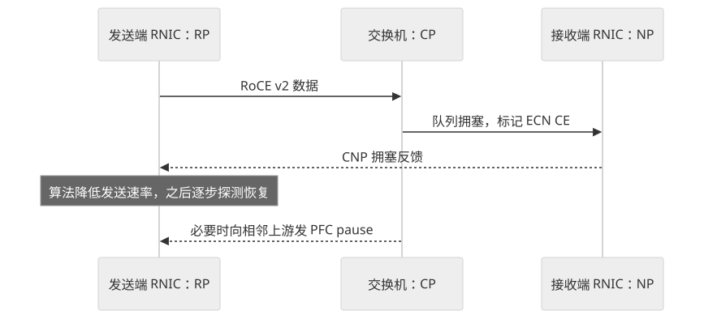
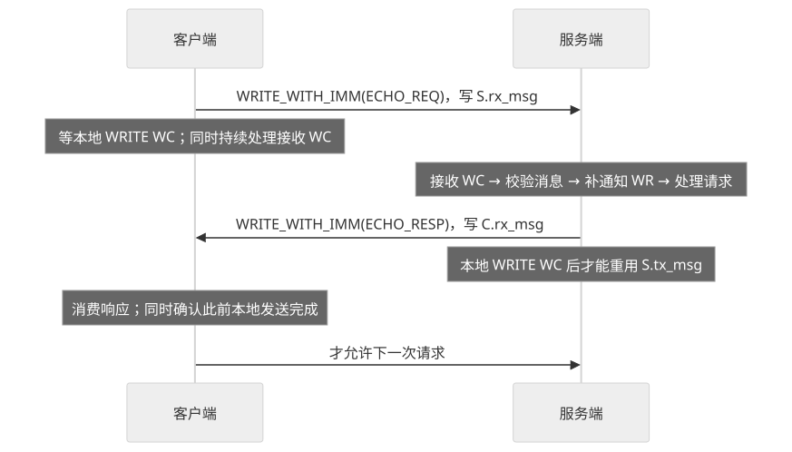
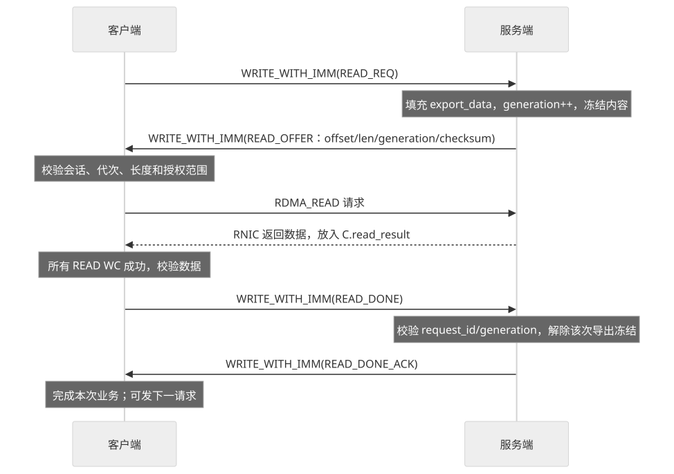

RDMA 编程需要同时理解三件事：设备怎样搬运数据，应用怎样知道数据可用，以及网络拥塞时怎样控制发送速率。本文从定义和关键词开始，逐步连接到 verbs 接口、网络调优，最后设计一个两端固定内存的客户端/服务端 demo：小消息使用 **RDMA WRITE WITH IMMEDIATE** 写入并通知，大块数据使用 **RDMA READ** 直接拉取。

主线采用 Linux 用户态 libibverbs、RC QP 和普通主机内存。常说的 `ib_verbs` 在用户态通常指 `<infiniband/verbs.h>` 中的 `ibv_*` 接口；内核 `<rdma/ib_verbs.h>` 中的 `ib_*` 是另一套 API。[Linux 用户态 verbs 文档](https://docs.kernel.org/infiniband/user_verbs.html)

<a id="reading"></a>

## 阅读路线

1. [基本定义与关键词](#basics)：RDMA、IB、RoCE、QP、MR、CQ、lkey/rkey。
2. [ibverbs 接口与通信流程](#verbs)：资源创建、QP 状态、WR 提交、完成处理。
3. [示例与实验](#lab)：可下载 C 函数、官方工具、错误定位。
4. [拥塞控制与性能优化](#congestion)：PFC、ECN/CNP、DCQCN、QCN、TIMELY、HPCC，以及 IB / RoCE v2 的调优方法。
5. [固定内存 Demo](#demo)：消息协议、READ 分块、完成顺序和内存所有权。
6. [官方资料](#sources)：进一步阅读的上游手册、源码与论文。

**配套代码：** [下载教学 C 函数](verbs_examples.c)。文末提供完整双机 demo 的协议设计，附带代码用于说明底层接口。

封面为《学园偶像大师》筱泽广主题 AI 插画。

<a id="basics"></a>

## 基本定义与关键词

### RDMA 到底是什么

**RDMA（Remote Direct Memory Access，远程直接内存访问）是一种让通信设备在授权范围内，直接搬运本机与远端内存数据的机制。** 对典型硬件 RDMA 的单边 READ/WRITE，远端应用不必为每一次搬运执行 `recv()` 或复制数据；它仍需提前准备连接、内存及访问权限。[NVIDIA RDMA 编程概览](https://networking-docs.nvidia.com/doca/archive/3-5-0/rdma-aware-networks-programming-guide)

可以想成：B 先开放一块有边界、有权限的缓冲区，再告诉 A 如何访问。A 提交“把这些字节写进 B 的这块区域”，两端网卡执行搬运。**B 后续怎样知道数据可用、何时处理、何时允许覆盖，仍由应用协议决定。**

#### DMA、RDMA、共享内存分别是什么

| 概念 | 数据搬运范围 | 编程时要关注什么 |
|---|---|---|
| DMA | 设备与内存之间，典型场景在一台主机内 | 地址映射、缓冲区、设备完成通知 |
| RDMA | 经过网络，在两端授权内存之间搬运 | 连接、远端区域描述、异步完成、所有权 |
| 进程共享内存 | 多个进程映射同一片内存 | 本机进程同步与内存模型 |

RDMA 并不会把两台机器自动变成一个统一、缓存一致的地址空间。`remote_addr` 是交给 RDMA 设备解释的地址信息，A 的 CPU 不能把 B 的地址直接解引用成普通指针。[MR 地址与访问规则](https://github.com/linux-rdma/rdma-core/blob/36f7ed8b9ce39c73444616c1dcee3ae734b138fb/libibverbs/man/ibv_reg_mr.3)

#### “零拷贝”和“内核旁路”的准确含义

- **零拷贝**：典型数据路径可以省去用户缓冲区与内核网络缓冲区之间的额外复制；数据仍会经过内存、PCIe 和网络，应用也可能因序列化或布局转换发生复制。
- **内核旁路**：资源建立后，典型硬件快路径可在用户态提交任务、访问映射的设备寄存器；设备打开、内存注册、资源管理等慢路径仍涉及内核。
- **CPU 卸载**：网卡承担部分传输工作；应用构造 WR、轮询 CQ、处理数据仍用 CPU。忙轮询可能占满一个核。
- **软件 RDMA**：RXE/SIW 能帮助学习接口，但软件执行不具备硬件卸载的性能含义。

这些说法描述具体数据路径，不能推广成“所有 RDMA 操作都不耗 CPU、不进内核、没有复制”。[Linux 用户态快慢路径](https://docs.kernel.org/infiniband/user_verbs.html)、[rdma-core 软件设备说明](https://github.com/linux-rdma/rdma-core/blob/36f7ed8b9ce39c73444616c1dcee3ae734b138fb/README.md)



<details>
<summary>查看流程图源码</summary>

```text
flowchart LR
    A["应用 A：准备缓冲区并提交 WR"] --> QA["A 的 QP / SQ"]
    QA --> NA["A 的 RDMA 网卡"]
    MA["A 的注册内存 MR"] <--> NA
    NA <--> NET["IB / RoCE / iWARP 网络"]
    NET <--> NB["B 的 RDMA 网卡"]
    NB <--> MB["B 的授权 MR"]
    NA --> CA["A 的 CQ：本地完成"]
    NB -. "SEND 或 WRITE_WITH_IMM" .-> CB["B 的 CQ：接收完成"]
```

</details>

图中的接收 CQ 通知取决于操作类型；普通 RDMA WRITE/READ 不会自动给远端应用生成一次接收完成。

### RDMA、IB、RoCE、iWARP、verbs 的关系

| 名称 | 展开 / 含义 | 所处层次 |
|---|---|---|
| RDMA | Remote Direct Memory Access | 数据访问与传输能力 |
| IB | InfiniBand | 有自身链路、寻址和管理机制的网络体系 |
| RoCE v1 | RDMA over Converged Ethernet | RDMA 运行在以太网二层之上 |
| RoCE v2 | 带 IP/UDP 封装的 RoCE | 可以经过 IP 路由；UDP 目的端口通常为 4791 |
| iWARP | 基于 RDMAP/DDP 等协议，常见承载为 TCP | 在 TCP 上提供 RDMA 语义 |
| verbs | RDMA 资源与操作的接口抽象 | 描述创建 QP、注册 MR、提交操作等能力 |
| libibverbs | Linux 用户态 verbs 库 | 对应用提供 `ibv_*` API |
| provider | 设备对应的用户态实现 | 将通用 API 转换成设备支持的操作 |
| librdmacm | RDMA Communication Manager 库 | 地址、路由解析和连接管理 |

**RoCE v2 使用 UDP 封装，不等于 RC 变成不可靠传输。** RC 的可靠性属于 RDMA 传输服务；UDP 是其网络封装的一部分。iWARP 的 TCP 承载也不意味着普通 TCP 网卡自动变成硬件 RDMA 网卡。[NVIDIA RoCE 网络说明](https://docs.nvidia.com/networking-ethernet-software/cumulus-linux-50/Layer-1-and-Switch-Ports/Quality-of-Service/RDMA-over-Converged-Ethernet-RoCE/)、[RFC 5040：RDMAP](https://www.rfc-editor.org/rfc/rfc5040.html)

`libibverbs` 这个名字带 `ib`，仍可通过不同 provider 使用多种 RDMA 设备。是否支持某种 QP 类型和操作，要查设备能力；不能仅根据函数出现在头文件中作判断。[rdma-core 组成](https://github.com/linux-rdma/rdma-core/blob/36f7ed8b9ce39c73444616c1dcee3ae734b138fb/README.md)、[ibv_query_device](https://github.com/linux-rdma/rdma-core/blob/36f7ed8b9ce39c73444616c1dcee3ae734b138fb/libibverbs/man/ibv_query_device.3)

### 关键词：先掌握这一组

#### 设备、内存和保护

| 词 | 全称 / 类型 | 用人话解释 |
|---|---|---|
| RNIC | RDMA-capable NIC | 能执行 RDMA 的网卡，泛称 |
| HCA | Host Channel Adapter | IB 体系中的主机适配器；资料中也常见于厂商设备描述 |
| device | `struct ibv_device` | 枚举得到的 RDMA 设备 |
| context | `struct ibv_context` | 打开某台设备后的用户态访问上下文 |
| port | 设备端口 | 同一设备可能有多个端口；不是 TCP 端口 |
| PD | Protection Domain | 保护域，约束 QP、MR 等资源能否配合使用 |
| MR | Memory Region | 注册给设备访问的一段内存及其权限、地址映射 |
| lkey | Local Key | 本地 SGE 访问 MR 时提供给本地设备的 key |
| rkey | Remote Key | 对端执行 READ/WRITE/Atomic 时携带的访问 key |
| MW | Memory Window | 在已有 MR 上建立可管理的访问窗口，进阶授权机制 |

PD 是设备资源的逻辑保护边界；CQ 通过 context 创建，本身不是用 `ibv_alloc_pd()` 分配出来的 PD 成员。不要画成“所有 RDMA 对象都隶属于 PD”。[ibv_alloc_pd](https://github.com/linux-rdma/rdma-core/blob/36f7ed8b9ce39c73444616c1dcee3ae734b138fb/libibverbs/man/ibv_alloc_pd.3)、[ibv_create_cq](https://github.com/linux-rdma/rdma-core/blob/36f7ed8b9ce39c73444616c1dcee3ae734b138fb/libibverbs/man/ibv_create_cq.3)

**记忆例子：** A 写 B 时，A 的 `sge.lkey` 来自 A 的 MR；A 填入 `wr.wr.rdma.rkey` 的值来自 B。`rkey` 用于设备访问检查，不是加密密钥，也不代替连接认证。[ibv_reg_mr](https://github.com/linux-rdma/rdma-core/blob/36f7ed8b9ce39c73444616c1dcee3ae734b138fb/libibverbs/man/ibv_reg_mr.3)

#### 队列、任务和完成

| 词 | 全称 / 类型 | 作用 |
|---|---|---|
| QP | Queue Pair | 队列对，通常包含 SQ 和 RQ；连接型 QP 保存对端与传输状态 |
| SQ | Send Queue | 放发起的操作，**包括 RDMA READ**，不限于向外发数据 |
| RQ | Receive Queue | 放预先准备的接收工作请求 |
| WQ | Work Queue | SQ/RQ 的统称 |
| WR | Work Request | 应用提交的工作描述，如 `ibv_send_wr`、`ibv_recv_wr` |
| WQE | Work Queue Element | provider/设备队列中的工作项；与应用 WR 不是同一个结构体 |
| SGE | Scatter/Gather Element | 一段本地缓冲区：`addr + length + lkey` |
| SGL | Scatter/Gather List | 多个 SGE，描述逻辑上拼接的数据 |
| CQ | Completion Queue | 完成队列；一个 CQ 可以服务多个 QP |
| CQE | Completion Queue Entry | 完成队列中的一项设备完成信息 |
| WC | Work Completion | `ibv_poll_cq()` 返回的 `struct ibv_wc`，包含状态与 WR 标识 |
| SRQ | Shared Receive Queue | 多个 QP 共用的接收队列；使用时向 SRQ 补接收 WR |
| doorbell | 门铃 | provider 通知网卡有新工作的一类机制，普通 verbs 应用不直接写 |

“提交任务”与“取出结果”是两个阶段。`ibv_post_send()` 返回 0，只说明这一批请求已成功提交；完成状态从 CQ 中读取。CQE/WC 也并非都代表成功。[ibv_post_send](https://github.com/linux-rdma/rdma-core/blob/36f7ed8b9ce39c73444616c1dcee3ae734b138fb/libibverbs/man/ibv_post_send.3)、[ibv_poll_cq](https://github.com/linux-rdma/rdma-core/blob/36f7ed8b9ce39c73444616c1dcee3ae734b138fb/libibverbs/man/ibv_poll_cq.3)

#### 寻址、连接和网络

| 词 | 解释 | 编程关注点 |
|---|---|---|
| QPN | QP Number | 标识某个 QP；不是机器 IP 或 TCP 端口 |
| PSN | Packet Sequence Number | 包序列号，RC/UC 建连要设置收发起始值；是 24 位值 |
| LID | Local Identifier | IB 子网中的本地标识；RoCE 不照搬 IB 的 LID 寻址 |
| GID | Global Identifier | 128 位标识；RoCE 需同时考虑对应网口、IP 和 GID 类型 |
| GID index | 本地 GID 表下标 | 索引是本机属性，两端不要求下标相同 |
| AH / AV | Address Handle / Address Vector | 路径描述；UD 发送使用 AH，RC 配置 QP 的 `ah_attr` |
| GRH | Global Routing Header | 全局路由相关信息；RoCE 的路径设置通常需要 global 地址属性 |
| P_Key | Partition Key | IB 分区相关；`pkey_index` 是本地表下标 |
| Q_Key | Queue Key | UD 接收访问检查相关，与 MR 的 rkey 不同 |
| MTU / path_mtu | 单包 / 路径传输单元 | RC 消息可拆成多个包；不能把消息长度等同于 MTU |
| SM | Subnet Manager | IB 子网管理组件；IB 链路接通后仍要具备正确子网配置 |

查询入口是 `ibv_query_port()`、`ibv_query_gid()` / `ibv_query_gid_ex()`；QP 属性用 `ibv_modify_qp()` 设置。字段具体取值必须来自本机查询、网络配置和对端交换，不能直接复制别人的 `gid_index=3`。[端口查询](https://github.com/linux-rdma/rdma-core/blob/36f7ed8b9ce39c73444616c1dcee3ae734b138fb/libibverbs/man/ibv_query_port.3)、[GID 扩展查询](https://github.com/linux-rdma/rdma-core/blob/36f7ed8b9ce39c73444616c1dcee3ae734b138fb/libibverbs/man/ibv_query_gid_ex.3.md)、[QP 属性](https://github.com/linux-rdma/rdma-core/blob/36f7ed8b9ce39c73444616c1dcee3ae734b138fb/libibverbs/man/ibv_modify_qp.3)

#### 通知、流控和优化

| 词 | 含义 | 常见误解 |
|---|---|---|
| signaled | 要求发送侧完成通知 | 不是给对端应用发通知 |
| unsignaled | 正常成功时不为该发送 WR 单独生成 WC | 不表示失败也一定没有 WC，更不表示可以立即覆盖缓冲区 |
| inline | 将小数据复制进发送 WQE | 与 immediate 无关；会有一次提交时的小数据复制 |
| immediate / imm | 随操作携带的 32 位值 | 在接收 WC 中读取，不是 payload 的前四字节 |
| RNR | Receiver Not Ready | 对端缺接收 WR；典型涉及 SEND、WRITE_WITH_IMM |
| credit | 应用维护的可用槽位 / 接收额度 | 普通 WRITE 不消耗 RQ，也仍可能覆盖未处理的数据 |
| fence | 限制同 QP 后续操作的启动顺序 | 不等价于 C++ 内存屏障或跨 QP 全局屏障 |
| PFC | Priority Flow Control | 以太网按优先级暂停，属于链路流控 |
| ECN / CNP | 拥塞标记 / 拥塞通知包 | 用于拥塞反馈，不负责提供应用业务完成通知 |
| NUMA | Non-Uniform Memory Access | 网卡、CPU 和内存的位置影响实际访问成本 |
| ODP | On-Demand Paging | 按需分页型 MR，需要设备和软件支持 |

RoCE 网络常结合 PFC 与 ECN 配置；具体采用无损、半无损或其他方案，应遵循所用 NIC/交换机的支持范围。不要把“所有 RoCE 都必须开启 PFC”当成协议定义。[NVIDIA RoCE 配置模式](https://docs.nvidia.com/networking-ethernet-software/cumulus-linux-510/Layer-1-and-Switch-Ports/Quality-of-Service/RDMA-over-Converged-Ethernet-RoCE/)

inline、signaled 的约束见 [ibv_post_send](https://github.com/linux-rdma/rdma-core/blob/36f7ed8b9ce39c73444616c1dcee3ae734b138fb/libibverbs/man/ibv_post_send.3)；ODP 和 relaxed ordering 见 [MR 手册](https://github.com/linux-rdma/rdma-core/blob/36f7ed8b9ce39c73444616c1dcee3ae734b138fb/libibverbs/man/ibv_reg_mr.3)。

### RC、UC、UD 怎么选

以下描述常见 IB/RoCE verbs 传输服务；实际设备是否提供对应能力，仍须查询。

| 能力 | RC：Reliable Connected | UC：Unreliable Connected | UD：Unreliable Datagram |
|---|---|---|---|
| 对端关系 | 一个 QP 连接一个对端 QP | 一个 QP 连接一个对端 QP | 每次发送可以指定不同目的地 |
| 交付语义 | 提供可靠、有序传输，仍可能超时失败 | 不提供 RC 那样的可靠重传 | 可能丢包、乱序 |
| SEND / RECV | 支持 | 支持 | 支持 |
| RDMA WRITE | 支持 | 支持 | 不支持 |
| RDMA READ | 支持 | 不支持 | 不支持 |
| 基础 64 位 Atomic | 设备支持时可用 | 不支持 | 不支持 |
| 消息大小 | 可大于 path MTU，由传输层分包 | 可大于 path MTU | 单消息受单包大小限制 |

学习主线使用 RC，可以在同一套资源上依次理解 SEND、WRITE、READ。可靠传输仍需要应用处理进程退出、重连和失败后的状态不确定性。[支持的 opcode 表](https://github.com/linux-rdma/rdma-core/blob/36f7ed8b9ce39c73444616c1dcee3ae734b138fb/libibverbs/man/ibv_post_send.3)、[NVIDIA 传输服务说明](https://networking-docs.nvidia.com/doca/archive/3-5-0/rdma-aware-networks-programming-guide)

### 四种操作要彻底分清

下表以 RC 成功路径为例。本地发送完成假定启用了 signaled；远端 CQ 指接收 CQ。

| 操作 | 数据方向 | 谁指定远端数据位置 | 消耗远端接收 WR | 远端接收 WC |
|---|---|---|---|---|
| SEND | A → B | B 预先 post 的接收 SGE | 是 | `IBV_WC_RECV` |
| SEND_WITH_IMM | A → B + 32 位通知值 | B 预先 post 的接收 SGE | 是 | `IBV_WC_RECV`，带 `IBV_WC_WITH_IMM` |
| RDMA WRITE | A → B | A 携带 B 授权的地址和 rkey | 否 | 无 |
| RDMA WRITE_WITH_IMM | A → B + 32 位通知值 | 数据按远端地址/rkey 放置 | **是** | `IBV_WC_RECV_RDMA_WITH_IMM` |
| RDMA READ | B → A | A 携带 B 授权的地址和 rkey | 否 | 无 |
| Atomic | 更新 B 的 64 位目标，旧值返回 A | A 携带 B 授权的地址和 rkey | 否 | 无 |

WRITE_WITH_IMM 的数据写入 **远端 MR 指定地址**，并不写入那个被消耗的接收 WR 的数据缓冲区。接收 WR 在这里提供接收通知资源。[操作定义](https://networking-docs.nvidia.com/doca/archive/3-5-0/rdma-aware-networks-programming-guide)、[接收完成结构与标志](https://github.com/linux-rdma/rdma-core/blob/36f7ed8b9ce39c73444616c1dcee3ae734b138fb/libibverbs/man/ibv_poll_cq.3)、[RDMA 写入与 Atomic 语义](https://github.com/linux-rdma/rdma-core/blob/36f7ed8b9ce39c73444616c1dcee3ae734b138fb/libibverbs/man/ibv_wr_post.3.md)

**为什么 READ 仍然调用 `ibv_post_send()`？** 因为“send queue”表达发起请求的队列。READ 的请求从 A 发出，数据由 B 返回并写入 A 的 SGE，A 从本地 CQ 得到 `IBV_WC_RDMA_READ`。

### 用一个 4 KiB 数据块理解应用协议

假设 A 要把一个 4 KiB 数据块交给 B 处理。

1. **SEND**：B 挂接收缓冲区 → A SEND → B 取接收 WC → B 处理数据 → B 回业务 ACK。
2. **WRITE_WITH_IMM**：B 授权数据槽并准备接收通知 WR → A 写槽并携带槽位编号 → B 取 WC，检查 immediate 与槽位代次 → B 处理 → B 归还额度。
3. **普通 WRITE**：B 授权数据槽 → A 写入并取得本地完成 → A 通过约定控制消息通知 B → B 读取处理。控制消息的顺序、内存可见性和槽位重用必须纳入协议。

这些是基于前述接口语义设计的教学流程，不是 verbs 自动提供的业务协议。`wr_id` 是本地跟踪值，不会自动作为远端请求编号送达；业务请求 ID 需要放进 payload、immediate 或显式控制消息。

<a id="verbs"></a>

## ibverbs 接口与通信流程

### 建立一条 RC 通信路径



<details>
<summary>查看流程图源码</summary>

```text
flowchart TD
    A["枚举并打开设备"] --> B["查询设备、端口、GID 和能力"]
    B --> C["分配 PD，准备并注册内存 MR"]
    C --> D["创建 CQ 与 RC QP"]
    D --> E["QP：RESET → INIT"]
    E --> F["预投递接收 WR"]
    F --> G["交换连接参数与内存区域描述"]
    G --> H["QP：INIT → RTR → RTS"]
    H --> I["双方确认 READY"]
    I --> J["提交 SEND / WRITE / READ，处理 WC"]
    J --> K["停止新任务，协调对端，完成清理"]
```

</details>

这是手工建立 **IB/RoCE RC QP** 的流程。iWARP 的连接建立应走 RDMA CM，不能直接套用 LID/GID/PSN 手工建连例子。使用 `rdma_create_qp()` 与 CM 建连时，由 CM 管理相应状态转换，应用不要再独立执行一套冲突的 `ibv_modify_qp()`。[rdma_cm](https://github.com/linux-rdma/rdma-core/blob/36f7ed8b9ce39c73444616c1dcee3ae734b138fb/librdmacm/man/rdma_cm.7)、[rdma_create_qp](https://github.com/linux-rdma/rdma-core/blob/36f7ed8b9ce39c73444616c1dcee3ae734b138fb/librdmacm/man/rdma_create_qp.3)

### 资源接口速查

| 阶段 | 接口 | 参数 / 结果要点 |
|---|---|---|
| 枚举 | `ibv_get_device_list(&count)` | 返回设备列表；0 台设备和调用失败要分开 |
| 选设备 | `ibv_get_device_name(device)` | 按明确名称选择，避免默认第一张卡 |
| 打开 | `ibv_open_device(device)` | 返回 `ibv_context *` |
| 查询能力 | `ibv_query_device(ctx, &attr)` | QP/CQ 数量、SGE、Read/Atomic 深度、atomic 能力 |
| 查询端口 | `ibv_query_port(ctx, port, &attr)` | `state`、`active_mtu`、`link_layer` 等 |
| 查询 GID | `ibv_query_gid(ctx, port, index, &gid)` | 现代版本可用 `ibv_query_gid_ex()` 获得类型和网口信息 |
| 保护域 | `ibv_alloc_pd(ctx)` | 返回 `ibv_pd *` |
| 注册内存 | `ibv_reg_mr(pd, addr, len, access)` | 返回 MR，内含 `lkey/rkey` |
| 完成队列 | `ibv_create_cq(ctx, cqe, user, channel, vector)` | `channel=NULL` 可只使用 polling |
| 队列对 | `ibv_create_qp(pd, &init_attr)` | 指定 CQ、队列容量、SGE 数和 `IBV_QPT_RC` |
| 状态切换 | `ibv_modify_qp(qp, &attr, mask)` | 只设置 mask 声明的字段 |
| 预备接收 | `ibv_post_recv(qp, &wr, &bad_wr)` | 给接收方提供容量，调用本身不等待消息 |
| 提交操作 | `ibv_post_send(qp, &wr, &bad_wr)` | SEND、WRITE、READ、Atomic 都从这里提交 |
| 收割完成 | `ibv_poll_cq(cq, count, wc_array)` | 返回完成个数；每个 WC 还要检查 `status` |

列表打开后，应在释放设备列表前打开所有想保留的设备；随后可以 `ibv_free_device_list()`。[设备枚举手册](https://github.com/linux-rdma/rdma-core/blob/36f7ed8b9ce39c73444616c1dcee3ae734b138fb/libibverbs/man/ibv_get_device_list.3.md)、[设备打开手册](https://github.com/linux-rdma/rdma-core/blob/36f7ed8b9ce39c73444616c1dcee3ae734b138fb/libibverbs/man/ibv_open_device.3)

### MR：内存注册和访问权限

```c
#include <infiniband/verbs.h>

/* buf 已分配且保持有效；pd 是本设备的有效 PD。 */
struct ibv_mr *mr = ibv_reg_mr(pd, buf, bytes,
    IBV_ACCESS_LOCAL_WRITE |
    IBV_ACCESS_REMOTE_WRITE |
    IBV_ACCESS_REMOTE_READ);
if (mr == NULL) {
    /* 保存 errno，报告失败并清理此前已分配的资源。 */
}
```

此处为片段，完整分配和错误路径由调用方负责。注册普通 MR 时一般会建立 DMA 映射并锁定对应页；`malloc()` 成功不代表注册必然成功，还涉及 memlock、设备资源和 provider 限制。ODP 是另一种模式。[Linux 内存锁定](https://docs.kernel.org/infiniband/user_verbs.html)

| 缓冲区用途 | 需要的 MR 权限 |
|---|---|
| 本地 SEND / WRITE 的数据源 | 本地读取默认允许；不用为了“发出去”开放 REMOTE_WRITE |
| 本地 RECV、READ 或 Atomic 的结果目标 | `IBV_ACCESS_LOCAL_WRITE` |
| 允许对端 WRITE | `IBV_ACCESS_LOCAL_WRITE | IBV_ACCESS_REMOTE_WRITE` |
| 允许对端 READ | `IBV_ACCESS_REMOTE_READ` |
| 允许对端 Atomic | `IBV_ACCESS_LOCAL_WRITE | IBV_ACCESS_REMOTE_ATOMIC` |

上表约束设备对内存的访问，不是限制本机 CPU 能不能用普通 C 赋值写缓冲区。远程操作还受 QP 的 `qp_access_flags` 约束，必须与 MR 权限配合。[ibv_reg_mr](https://github.com/linux-rdma/rdma-core/blob/36f7ed8b9ce39c73444616c1dcee3ae734b138fb/libibverbs/man/ibv_reg_mr.3)、[ibv_modify_qp](https://github.com/linux-rdma/rdma-core/blob/36f7ed8b9ce39c73444616c1dcee3ae734b138fb/libibverbs/man/ibv_modify_qp.3)

对端通常至少需要知道 `remote_addr + length + rkey`。生产协议还应带区域用途、协议版本、连接会话和区域代次。不能把有填充字节的本机 C 结构体直接发到线上；用明确字段宽度、字节序和长度编码。本文示例限普通 `ibv_reg_mr()` 地址模式，zero-based、IOVA 和 GPU MR 需要另外处理。

### CQ 和 QP 的创建

```c
/* 仅展示资源参数；失败时必须逐级清理。 */
struct ibv_cq *cq = ibv_create_cq(ctx, 256, NULL, NULL, 0);
if (cq == NULL) {
    /* 处理 errno。 */
}

struct ibv_qp_init_attr init = {0};
init.send_cq = cq;
init.recv_cq = cq;
init.qp_type = IBV_QPT_RC;
init.cap.max_send_wr = 64;
init.cap.max_recv_wr = 64;
init.cap.max_send_sge = 1;
init.cap.max_recv_sge = 1;
init.cap.max_inline_data = 0;
init.sq_sig_all = 0;

struct ibv_qp *qp = ibv_create_qp(pd, &init);
if (qp == NULL) {
    /* 处理 errno；随后销毁 cq。 */
}
```

这里 SQ/RQ 共用一个 CQ，所以轮询时会混合出现发送、读取和接收的完成。创建成功后读回 `init.cap` 的实际值；设备能力上限也不保证当前资源一定足够。CQ 大小应覆盖可能未及时消费的完成数，并留出错误/flush 场景空间。[ibv_create_qp](https://github.com/linux-rdma/rdma-core/blob/36f7ed8b9ce39c73444616c1dcee3ae734b138fb/libibverbs/man/ibv_create_qp.3)、[ibv_create_cq](https://github.com/linux-rdma/rdma-core/blob/36f7ed8b9ce39c73444616c1dcee3ae734b138fb/libibverbs/man/ibv_create_cq.3)

### RESET → INIT → RTR → RTS

| 切换 | 建立的信息 | RC 的核心字段 |
|---|---|---|
| RESET → INIT | 本端端口、分区及允许的远端操作 | `port_num`、`pkey_index`、`qp_access_flags` |
| INIT → RTR | 对端身份、路径和接收序列 | `dest_qp_num`、`ah_attr`、`path_mtu`、`rq_psn`、`max_dest_rd_atomic`、`min_rnr_timer` |
| RTR → RTS | 本端发送序列、重试与发起深度 | `sq_psn`、`timeout`、`retry_cnt`、`rnr_retry`、`max_rd_atomic` |

每次还需设置 `qp_state` 和 `IBV_QP_STATE`。完整函数在 [verbs_examples.c](verbs_examples.c) 的 `demo_qp_init/rtr/rts()` 中。

- A 的 `dest_qp_num` 是 B 的 QPN；A 的 `rq_psn` 是 B 的起始发送 PSN；A 的 `sq_psn` 是 A 自己的 PSN。
- `max_rd_atomic` 是本 QP 允许向外发起的未完成 READ/Atomic 数；`max_dest_rd_atomic` 是本 QP 接受对端 READ/Atomic 的 responder 资源。两端和设备能力需要匹配。
- IB 同子网可以使用 LID 路径；RoCE 通常需要 `is_global=1`、对端 GID、本地 `sgid_index` 和合适的 `hop_limit`，并满足网口、IP、GID 类型与路径 MTU 的约束。
- `timeout`、`min_rnr_timer` 是编码值，不能直接当毫秒。示例值只是教学配置；其中 `rnr_retry=7` 有无限重试的特殊含义，demo 使用有限重试并另设业务超时。

必须先投递接收资源并通过握手确认双方就绪，再发依赖接收 WR 的操作。QP 达到 RTS 只证明本地配置转换成功。[上游 QP 状态转换表](https://github.com/linux-rdma/rdma-core/blob/36f7ed8b9ce39c73444616c1dcee3ae734b138fb/libibverbs/man/ibv_modify_qp.3)、[RDMA CM 参数说明](https://github.com/linux-rdma/rdma-core/blob/36f7ed8b9ce39c73444616c1dcee3ae734b138fb/librdmacm/man/rdma_connect.3)

### WR、SGE 和提交方式

接收 WR 主要描述“本机哪里可以接收、最多多长”；发送 WR 则额外描述“做哪一种操作”。

```c
struct ibv_sge sge = {
    .addr = (uint64_t)(uintptr_t)local_buf,
    .length = length,
    .lkey = local_mr->lkey,
};
struct ibv_send_wr wr = {0};
struct ibv_send_wr *bad_wr = NULL;
wr.wr_id = request_id;
wr.sg_list = &sge;
wr.num_sge = 1;
wr.opcode = IBV_WR_RDMA_WRITE;
wr.send_flags = IBV_SEND_SIGNALED;
wr.wr.rdma.remote_addr = peer_addr;
wr.wr.rdma.rkey = peer_rkey;

int rc = ibv_post_send(qp, &wr, &bad_wr);
if (rc != 0) {
    fprintf(stderr, "post: %s\n", strerror(rc));
}
```

这个片段需要 `stdint.h`、`stdio.h`、`string.h`；对应的教学函数包含在附带 C 文件中。

`wr` 和 `sge` 这类描述符在提交函数返回后可以结束生命周期；**它们指向的数据缓冲区仍须有效**。非 inline 的发送/写入源缓冲区应等相应完成后再重用；READ 结果在成功完成前不能交给业务读取。[ibv_post_send](https://github.com/linux-rdma/rdma-core/blob/36f7ed8b9ce39c73444616c1dcee3ae734b138fb/libibverbs/man/ibv_post_send.3)

#### 操作之间改哪些字段

| 目的 | `opcode` | 本地 SGE | 附加字段 |
|---|---|---|---|
| 发送消息 | `IBV_WR_SEND` | 数据源 | RC 下不用提供远端 MR 地址 |
| 写对端 | `IBV_WR_RDMA_WRITE` | 数据源 | `wr.rdma.remote_addr/rkey` |
| 写并通知 | `IBV_WR_RDMA_WRITE_WITH_IMM` | 数据源 | 上述字段 + `imm_data=htonl(value)` |
| 读对端 | `IBV_WR_RDMA_READ` | **本地结果目标** | `wr.rdma.remote_addr/rkey` |
| 比较交换 | `IBV_WR_ATOMIC_CMP_AND_SWP` | 本地 8 字节旧值目标 | `wr.atomic.remote_addr/rkey/compare_add/swap` |
| 取旧值并加 | `IBV_WR_ATOMIC_FETCH_AND_ADD` | 本地 8 字节旧值目标 | `wr.atomic.remote_addr/rkey/compare_add` |

Atomic 的远端地址需满足 8 字节对齐，并检查设备支持与原子性范围。不要假设 NIC Atomic 能与远端 CPU 的 `std::atomic`、另一张 NIC 的写入形成统一原子域。[扩展 WR 手册的 Atomic 约束](https://github.com/linux-rdma/rdma-core/blob/36f7ed8b9ce39c73444616c1dcee3ae734b138fb/libibverbs/man/ibv_wr_post.3.md)

#### `bad_wr` 不是事务回滚

可以用 `wr.next` 串起一批 WR。中间某项立即失败时，`bad_wr` 指向第一项未成功提交的 WR；前面的请求可能已经进入队列。应用必须保留已提交部分的状态，不能整批覆盖、释放或无条件重发。

#### inline、signaled 与 fence

- `IBV_SEND_INLINE` 适合设备允许的小消息 SEND/WRITE；数据复制进 WQE，成功提交后源缓冲区就可重用。长度不能超过创建时实际支持的 `max_inline_data`。它不适用于 READ 的结果缓冲区。
- `IBV_SEND_SIGNALED` 在 `sq_sig_all=0` 时要求本地完成。初学阶段每个操作都 signaled，便于跟踪。
- 减少 signaled 可降低 CQ 工作量，但必须周期性插入完成点，并维护 SQ 额度和缓冲区回收。错误路径仍可能产生完成，不能按“永远只有每 N 条一个 WC”分配 CQ。
- 有前置 READ/Atomic 的数据依赖时，最易审查的方法是等其成功 WC 再提交后续操作；需要流水化时再根据 RC fence 语义使用 `IBV_SEND_FENCE`。它不协调另一条 QP，也不代替线程同步。

具体标志见 [ibv_post_send](https://github.com/linux-rdma/rdma-core/blob/36f7ed8b9ce39c73444616c1dcee3ae734b138fb/libibverbs/man/ibv_post_send.3)。

### 完成处理：三个层次不能混用

| 观察到的事件 | 能说明什么 | 仍不能说明什么 |
|---|---|---|
| `ibv_post_send()==0` | 请求已提交 | 传输成功、远端已处理 |
| 相应 `WC.status==IBV_WC_SUCCESS` | 对应操作按传输语义完成 | 对端业务执行成功、数据持久化 |
| 对端业务 ACK | 对端按约定处理到某一步 | 超出 ACK 定义之外的结果 |

从 CQ 取到 WC 后按顺序处理：先判断 `status`，再按 `wr_id/qp_num` 查本地操作，最后在字段有效时读取 `opcode/byte_len/imm_data`。失败 WC 只有 `wr_id`、`status`、`qp_num`、`vendor_err` 保证有效。共享 CQ 上不要为了等某个 ID，直接丢掉其他 WC。[ibv_poll_cq](https://github.com/linux-rdma/rdma-core/blob/36f7ed8b9ce39c73444616c1dcee3ae734b138fb/libibverbs/man/ibv_poll_cq.3)

WRITE_WITH_IMM 接收侧示意：

```c
/* 仅在 wc.status == IBV_WC_SUCCESS 后进入。 */
if (wc.opcode == IBV_WC_RECV_RDMA_WITH_IMM &&
    (wc.wc_flags & IBV_WC_WITH_IMM)) {
    uint32_t token = ntohl(wc.imm_data);
    /* 验证 token、消息头、长度、会话、槽位代次，然后交业务处理。 */
    /* 及时补接收 WR；此动作不等于归还消息槽位。 */
}
```

超时也不是撤销：轮询函数返回超时后，原 WR 仍可能完成，远端也可能已经看到数据。避免立即复用缓冲区或按相同业务 ID 盲目重做。

### CQ 事件与设备异步事件

忙轮询用于低延迟场景；空闲较多时，可使用 completion channel 配合 `poll/epoll`。

1. `ibv_create_comp_channel(ctx)`；创建 CQ 时关联该 channel。
2. 在操作可能完成前执行 `ibv_req_notify_cq(cq, 0)`；然后 drain 已有 CQE。
3. 等待 channel 可读，调用 `ibv_get_cq_event()`，并用 `ibv_ack_cq_events()` 确认已取事件。
4. **先重新 arm，再 drain CQ**，然后继续等待。

通知是一次性的；arm 不会替你消费 CQE。一次事件不等于一次 WC，也可能出现“收到事件但 CQ 已空”的情况。多个 CQ 共用 channel 时，按事件返回的 CQ 处理。设备错误事件另走 `ibv_get_async_event()` / `ibv_ack_async_event()`。[CQ 事件示例](https://github.com/linux-rdma/rdma-core/blob/36f7ed8b9ce39c73444616c1dcee3ae734b138fb/libibverbs/man/ibv_get_cq_event.3)、[通知规则](https://github.com/linux-rdma/rdma-core/blob/36f7ed8b9ce39c73444616c1dcee3ae734b138fb/libibverbs/man/ibv_req_notify_cq.3.md)、[异步事件](https://github.com/linux-rdma/rdma-core/blob/36f7ed8b9ce39c73444616c1dcee3ae734b138fb/libibverbs/man/ibv_get_async_event.3)

### 函数返回值分类

| 类别 | 示例 | 成功 | 失败检查 |
|---|---|---|---|
| 返回对象 | `ibv_open_device/reg_mr/create_qp/create_cq` | 非 NULL | NULL 后读 `errno` |
| 返回错误码 | `ibv_modify_qp/post_send/post_recv` | 0 | 直接读取返回的错误码，如 `strerror(rc)` |
| 返回数量 | `ibv_poll_cq` | ≥0，0 表示暂时无 WC | <0 表示轮询调用失败 |
| CQ 取事件 | `ibv_get_cq_event` | 0 | -1 并设置 `errno` |

不要把所有 `ibv_*` 都写成 `if (ret < 0) perror(...)`。也不要把 WC 的 `status` 当 POSIX errno，用 `ibv_wc_status_str()` 解释它。上游具体函数手册是最终依据。

### 连接管理与资源收尾

RDMA CM 客户端通常经历 `create_event_channel → create_id → resolve_addr → ADDR_RESOLVED → resolve_route → ROUTE_RESOLVED → create_qp/prepare_recv → connect → ESTABLISHED`。服务端经历 `create_id → bind_addr → listen → CONNECT_REQUEST → 对新 id 创建资源/prepare_recv → accept → ESTABLISHED`。每个 CM 事件处理后需 ack，事件中的 private data 要在 ack 前复制或解析。[CM 生命周期](https://github.com/linux-rdma/rdma-core/blob/36f7ed8b9ce39c73444616c1dcee3ae734b138fb/librdmacm/man/rdma_cm.7)、[CM 事件所有权](https://github.com/linux-rdma/rdma-core/blob/36f7ed8b9ce39c73444616c1dcee3ae734b138fb/librdmacm/man/rdma_get_cm_event.3)

清理顺序从依赖关系出发：停止新提交并协调对端停止访问 → 处理已提交操作或错误/flush → 销毁 QP → 处理完关联事件并销毁 CQ/channel → 注销 MR 后释放内存 → 释放 PD → 关闭 context。MR 不能因为“本机暂时没任务”就释放，对端的 READ/WRITE 生命周期也必须结束。

### 扩展接口入口

现代 `ibv_wr_*` API 使用 `ibv_create_qp_ex()` 声明需要的操作，取得 `ibv_qp_ex`，在 `ibv_wr_start()` 与 `ibv_wr_complete()` 之间通过 builder/setter 构造操作。它可以减少提交路径分支或锁的开销，但依赖 provider 支持；`ibv_wr_complete()` 成功仍然表示提交，不是网络完成。[扩展 WR API](https://github.com/linux-rdma/rdma-core/blob/36f7ed8b9ce39c73444616c1dcee3ae734b138fb/libibverbs/man/ibv_wr_post.3.md)

<a id="lab"></a>

## 代码示例、实验与排错

### 附带 C 文件怎么读

[examples/verbs_examples.c](verbs_examples.c) 包含以下教学函数。它没有 `main()`，不包含双机握手和资源分配，不能直接当客户端或服务端执行。

| 函数 | 展示的接口 |
|---|---|
| `demo_qp_init/rtr/rts` | `ibv_modify_qp()` 的 RC 状态转换 |
| `demo_post_recv` | 用本地 MR/SGE 挂数据接收 WR |
| `demo_post_notification` | 为 RC WRITE_WITH_IMM 挂零 SGE 通知 WR |
| `demo_post_send` | 发送消息 |
| `demo_post_rdma` | WRITE、WRITE_WITH_IMM、READ，含基本范围检查 |
| `demo_post_atomic` | 64 位 CAS / Fetch-and-add |
| `demo_poll_one` | 单调时钟超时、WC 状态检查与错误日志 |

函数统一返回 0 或正错误码，这是示例封装的约定；底层 verbs 各自的返回规则见接口章节。`demo_poll_one()` 只取下一条 WC，不擅自丢弃其他请求的完成，调用方负责按 `wr_id/qp_num` 分派。超时不会取消 WR。


### 准备实验环境

现代 Debian/Ubuntu 实验机可按发行版包仓库准备开发库和工具；包名可能随发行版变化：

```sh
sudo apt-get install build-essential libibverbs-dev librdmacm-dev \
    ibverbs-providers ibverbs-utils rdmacm-utils perftest iproute2
```

先只读检查：

```sh
ibv_devices
ibv_devinfo
rdma link show
ip -br address
ulimit -l
```

没有硬件时，可在支持 RXE 的独立实验环境使用软件 RoCE；以下命令会修改实验机配置，本文未执行：

```sh
sudo modprobe rdma_rxe
sudo rdma link add rxe_demo type rxe netdev <实验网口>
rdma link show
```

`<实验网口>` 必须替换为实际接口。RXE 能验证部分 verbs 和协议行为，但其 CPU、吞吐、时延及拥塞表现不能当作硬件 IB/RoCE 结果。[rdma-core 软件 RDMA 说明](https://github.com/linux-rdma/rdma-core/blob/36f7ed8b9ce39c73444616c1dcee3ae734b138fb/README.md)

Docker 中运行真实 RDMA 还涉及宿主机驱动、设备节点、网络可达性、provider 和 memlock。

### 从官方工具开始验证

#### RC SEND/RECV

两端先检查 `ibv_rc_pingpong --help`，再分别运行。设备和 GID 索引使用各自本机的值，消息大小与迭代等业务参数保持一致。

```sh
ibv_rc_pingpong -d <设备> -i <端口> -g <本地GID索引> -s 4096 -n 1000

ibv_rc_pingpong -d <设备> -i <端口> -g <本地GID索引> -s 4096 -n 1000 <服务端地址>
```

该程序用 TCP 做初始同步，实际 ping-pong 数据走 RC；TCP 同步成功仍不代表 RDMA 路径成功。它是教学测试程序，上游手册也明确提示其同步与完成处理存在局限，不应直接当生产协议复制。[ibv_rc_pingpong 手册](https://github.com/linux-rdma/rdma-core/blob/36f7ed8b9ce39c73444616c1dcee3ae734b138fb/libibverbs/man/ibv_rc_pingpong.1)、[上游源码](https://github.com/linux-rdma/rdma-core/blob/36f7ed8b9ce39c73444616c1dcee3ae734b138fb/libibverbs/examples/rc_pingpong.c)

#### RDMA CM 与数据校验

```sh
rping -s -a <服务端RDMA地址> -p 7471 -v -V

rping -c -a <服务端RDMA地址> -p 7471 -C 100 -S 4096 -v -V
```

`-V` 启用数据校验；`-C` 让实验次数有界。地址需关联实际 RDMA 路径，例如 RoCE 网口 IP 或适当的 IPoIB 地址。[rping 手册](https://github.com/linux-rdma/rdma-core/blob/36f7ed8b9ce39c73444616c1dcee3ae734b138fb/librdmacm/man/rping.1)

#### WRITE / READ 基准

先检查 `--help`。如下为传统 TCP 交换连接信息的命令模板，RoCE 添加正确的本地 GID 索引；IB 不需要时省略 `-x`。

```sh
ib_write_bw -d <设备> -i <端口> -x <本地GID索引> -s 65536 -D 10
ib_write_bw -d <设备> -i <端口> -x <本地GID索引> -s 65536 -D 10 <服务端地址>

ib_read_lat -d <设备> -i <端口> -x <本地GID索引> -s 4096 -n 10000
ib_read_lat -d <设备> -i <端口> -x <本地GID索引> -s 4096 -n 10000 <服务端地址>
```

使用 `-R` 可以改为由 RDMA CM 建立测试 QP，但必须配置可解析的 RDMA 地址/路由。不同模式不要盲目混用参数。常见优化扫描参数有 `-t`（发送深度）、`-q`（QP 数）、`-o`（READ/Atomic 在途数）、`-l`（post list）、`-Q`（CQ moderation），具体支持以本机工具为准。[perftest](https://github.com/linux-rdma/perftest)

### 常见错误从哪查

| 现象 | 首查方向 |
|---|---|
| 没有设备 | 驱动、provider、RDMA 设备节点、容器映射 |
| MR 注册失败 | errno、memlock、地址/长度、权限组合、设备资源 |
| QP 转 RTR/RTS 失败 | mask、状态转换、GID/路径、MTU、read depth |
| `IBV_WC_LOC_LEN_ERR` | SGE/消息长度、接收容量、操作长度约束 |
| `IBV_WC_LOC_PROT_ERR` | 本地 lkey、PD、MR 范围/权限和生命周期 |
| `IBV_WC_REM_ACCESS_ERR` | 远端 rkey、地址范围、MR/QP 权限、是否已注销 |
| `IBV_WC_RNR_RETRY_EXC_ERR` | 对端 RQ/SRQ 是否缺接收 WR，是否及时补充 |
| `IBV_WC_RETRY_EXC_ERR` | 对端/路径/丢包/连接状态等，不能只据此认定交换机拥塞 |
| `IBV_WC_WR_FLUSH_ERR` | 常是此前错误导致后续 WR 被清理；寻找首个失败 |
| `IBV_EVENT_CQ_ERR` | CQ 消费不及时或容量不足，检查 overrun |
| 发送后没 WC | 是否 signaled、是否 poll 对 CQ、QP 是否就绪 |
| WRITE 有成功 WC，对端没处理 | 普通 WRITE 不通知应用；检查消息协议 |

这张表是排查入口，不是仅凭错误码就确认根因。保留双方时间、QP、WR ID、首个错误、vendor_err 和网络计数增量。[WC 与 CQ 错误规则](https://github.com/linux-rdma/rdma-core/blob/36f7ed8b9ce39c73444616c1dcee3ae734b138fb/libibverbs/man/ibv_poll_cq.3)、[上游状态枚举](https://github.com/linux-rdma/rdma-core/blob/36f7ed8b9ce39c73444616c1dcee3ae734b138fb/libibverbs/verbs.h)

<a id="congestion"></a>

## 拥塞控制与 IB / RoCE v2 性能优化

### 先区分三个不同问题

| 问题 | 典型表现 | 处理机制 |
|---|---|---|
| 网络链路 / 交换机队列拥塞 | 排队增长、丢包、pause、尾延迟升高 | PFC、ECN/DCQCN、路由与 QoS |
| 对端没有接收通知资源 | SEND / WRITE_WITH_IMM 出现 RNR | 及时补接收 WR、限制通知发送量 |
| 对端应用处理不及 | 消息槽或数据块未释放 | 应用额度、所有权和背压协议 |

**PFC、ECN、DCQCN 都不能告诉发送方“对端业务已经读完这块内存”。** 即使网络零丢包，普通 WRITE 仍可能覆盖尚未消费的数据。反过来，应用有空槽也不表示网络没有拥塞。后续 demo 会分别管理这些状态。

### PFC：按优先级逐跳暂停

PFC（Priority-based Flow Control）让接收设备在缓冲区压力大时，向相邻上游发送指定优先级的暂停请求。它控制的是**一跳上的某个优先级流量**，不是精确定位到某条应用连接的端到端速率算法。传统全链路 pause 会暂停整个链路，PFC 的粒度更细。[NVIDIA PFC/RoCE 说明](https://docs.nvidia.com/networking-ethernet-software/cumulus-linux-510/Layer-1-and-Switch-Ports/Quality-of-Service/RDMA-over-Converged-Ethernet-RoCE/)

PFC 可以给瞬时拥塞提供缓冲保护，但代价包括同优先级队头阻塞、拥塞向上游扩散、不公平，以及异常情况下的持续 pause。它不适合作为长期调节所有发送端速率的唯一手段。[DCQCN 原论文](https://www.microsoft.com/en-us/research/wp-content/uploads/2016/08/dcqcn-sigcomm15.pdf)

配置时要理解四个量：

- **XOFF**：触发暂停的水位。
- **XON**：允许恢复的水位；与 XOFF 留出滞回区间，减少反复暂停。
- **headroom**：发出暂停后，在途数据还会继续到达，需要额外缓冲。
- **pause duration / watchdog**：持续暂停的观测与异常处理。

headroom 应由链路速率、传播时间、设备反应时间和包大小估算，再按设备缓冲模型配置。不能把另一套网络的 KB 阈值直接复制过来。watchdog 是异常保护，可能通过丢弃流量恢复网络，不能代替拥塞控制。[NVIDIA 缓冲与 watchdog 配置说明](https://docs.nvidia.com/networking-ethernet-software/nvue-reference/Set-and-Unset-Commands/QoS/)

### ECN 与 CNP：一个标记，一个反馈

**ECN（Explicit Congestion Notification）是 IP 头中的拥塞标记机制。** ECN 字段为 2 位，可表示不支持 ECN、支持 ECN，以及 CE（Congestion Experienced）。交换机可以对可标记流量设置 CE，从而在不先丢包的情况下传达拥塞信息。[RFC 3168](https://www.rfc-editor.org/rfc/rfc3168.html)

在典型 RoCE v2 ECN/CNP 流程中：

1. 数据包经过拥塞交换机，被设置 ECN CE。
2. 接收端网卡发现标记，按实现的通知规则向发送端发 CNP。
3. 发送端网卡收到 CNP，由其拥塞控制算法调整速率。

**CNP（Congestion Notification Packet）不确认业务处理，也不是 WRITE_WITH_IMM。** CNP 属于网络拥塞反馈；immediate 属于应用可见的操作通知，两者不共用消息语义。[NVIDIA RoCE ECN](https://docs.nvidia.com/networking/display/OFEDv502180/Explicit%2BCongestion%2BNotification%2B%28ECN%29)



<details>
<summary>查看流程图源码</summary>

```text
sequenceDiagram
    participant A as 发送端 RNIC：RP
    participant W as 交换机：CP
    participant B as 接收端 RNIC：NP
    A->>W: RoCE v2 数据
    W->>B: 队列拥塞，标记 ECN CE
    B-->>A: CNP 拥塞反馈
    Note over A: 算法降低发送速率，之后逐步探测恢复
    W-->>A: 必要时向相邻上游发 PFC pause
```

</details>

最后一条是简化的一跳示意；多级网络中 PFC 发给相邻节点，CNP 返回流量源端。

### DCQCN：让 RoCE 发送端主动降速

DCQCN（Data Center Quantized Congestion Notification）是面向 RoCE v2 的端到端、基于速率的拥塞控制方案。其核心角色为：

| 角色 | 位置 | 工作 |
|---|---|---|
| CP：Congestion Point | 交换机 | 根据队列拥塞标记数据包 |
| NP：Notification Point | 接收端 | 观察拥塞标记并产生 CNP |
| RP：Reaction Point | 发送端 | 接收反馈，降低并逐步恢复发送速率 |

可以把它理解为“看到拥塞反馈就收油，拥塞缓解后再逐步加速”。ECN 提供信号，CNP 传回信号，DCQCN 决定如何调整速率。**只配置交换机 ECN，不核对接收端 CNP 与发送端 CC，闭环可能不完整。** [DCQCN 作者项目页](https://www.microsoft.com/en-us/research/?p=168656)

论文中的控制过程维护拥塞程度估计、当前速率、目标速率，以及基于时间/发送字节数的恢复阶段。它和 PFC 的分工是：端到端算法尽量让队列保持较低，逐跳暂停为来不及收敛的突发提供保护。不同固件的参数名称、默认值、算法扩展和优先级开关可能不同，不能把论文伪代码等同于所有设备实现。[DCQCN 原论文](https://www.microsoft.com/en-us/research/wp-content/uploads/2016/08/dcqcn-sigcomm15.pdf)、[NVIDIA DCQCN 参数映射](https://networking-docs.nvidia.com/doca/archive/3-5-0/dcqcn-cc-parameters)

工程上希望**拥塞标记能早于持续 PFC 压力起作用**，但 ECN 和 PFC 可能观察不同队列、不同缓冲池或不同计量口径。不要简单写出一个跨设备通用的 `ECN_threshold < PFC_threshold` 数字关系，就认为配置已正确。

### QCN、DCQCN、TIMELY、HPCC 有什么区别

| 机制 | 主要反馈 | 控制范围 / 依赖 | 适合怎样理解 |
|---|---|---|---|
| PFC | 邻接设备 pause | 二层、按优先级逐跳 | 缓冲保护与链路流控 |
| ECN | 数据包 CE 标记 | IP 网络，端点需响应 | 拥塞信号，不是完整算法 |
| QCN | 二层拥塞点反馈 | IEEE 802.1Qau 的受控域 | 以太网拥塞通知机制，不能直接当作跨 IP 路由的 DCQCN |
| DCQCN | ECN + CNP | RoCE v2，端点速率控制 | 常见 RoCE CC 方案 |
| TIMELY | RTT 及 RTT 变化 | 需要较准确的端点时延测量 | 从时延增长推断排队 |
| HPCC | INT 网络遥测 | 需要相应交换机/NIC 支持 | 获取链路负载后更精确调整速率 |

QCN 见 [IEEE 802.1Qau 项目说明](https://1.ieee802.org/dcb/802-1qau/)；TIMELY 见 [Google 原论文介绍](https://research.google/pubs/timely-rtt-based-congestion-control-for-the-datacenter/)；HPCC 见 [作者项目页](https://www.statslab.cam.ac.uk/~fpk1/PAPERS/hpcc.html)。这些方案的实验收益只代表论文对应的环境，本篇不把它们作为本机性能承诺。

厂商也提供基于 RTT 的 RoCE 算法及可编程拥塞控制，但能否使用取决于具体 NIC/DPU、固件和软件版本；论文算法不一定是普通网卡上一个可打开的开关。[NVIDIA 拥塞控制基础设施说明](https://networking-docs.nvidia.com/doca/archive/3-5-0/congestion-control-infrastructure)

### 无 PFC 的 RoCE 与 IB 的区别

RoCE 不应被定义成“必然必须开 PFC”。例如 NVIDIA 的部分交换机软件明确区分使用 ECN 的 `lossy` 模式和同时使用 PFC/ECN 的 `lossless` 模式。是否采用无 PFC 方案，需要结合端点拥塞控制、丢包恢复、突发负载和尾延迟目标评估，不能仅凭空载双机跑通决定。[NVIDIA RoCE 模式](https://docs.nvidia.com/networking-ethernet-software/nvue-reference/Set-and-Unset-Commands/QoS/)

**原生 IB 不使用以太网 PFC。** IB 有自身链路信用流控、SL/VL 服务等级与虚拟通道机制，并可使用原生拥塞控制和厂商提供的自适应路由。FECN/BECN 是 IB 资料中会遇到的拥塞通知术语；不要把它们写成 RoCE IP ECN 字段。[IB 架构概览](https://docs.nvidia.com/rdma-aware-networks-programming-user-manual-1-7.pdf)、[IB QoS](https://docs.nvidia.com/networking/display/mlnxofedv23100541/qos+-+quality+of+service)、[IB 拥塞计数器](https://docs.nvidia.com/networking/display/ufmenterpriseumv6231/Appendix-%E2%80%93-Diagnostic-Utilities)

### 带宽、时延和 CPU 必须一起衡量

至少区分下面几种指标：

- **链路线速与有效吞吐**：100 Gbit/s 换算为 12.5 GB/s 是十进制位/字节换算，尚未扣除协议开销。
- **单操作完成延迟**：如一次 READ 从提交到本地成功 WC。
- **业务 RTT**：WRITE_WITH_IMM 请求到业务处理后收到响应，包含双方软件调度与处理。
- **大块传输完成时间**：元数据协商、READ、校验和释放协议的总耗时。
- **P50/P99/P99.9、CPU 和公平性**：平均带宽不能解释小消息尾延迟或多流竞争。

下面优化项是根据接口语义、厂商资料和基准工具组合出的工程实验清单；预期方向不代表本机已经测得收益。

### IB / RoCE v2 共用的主机与应用优化

| 优化项 | 主要目的 | 代价与约束 | 怎么验证 |
|---|---|---|---|
| 网卡、worker、MR 尽量位于同 NUMA 节点 | 减少远端内存访问与互联开销 | 绑核后也要保证内存实际落在该节点 | 固定负载比较 NUMA 本地/跨节点 |
| 检查 PCIe 实际速率和宽度 | 排除总线带宽瓶颈 | 看实际协商状态，不只看插槽外观 | `lspci -vv`、双向吞吐 |
| 固定内存池与长生命周期 MR | 去掉热路径分配、注册和页缺失 | 注册内存占资源，需要正确回收 | 对比是否将注册算入计时 |
| 小消息 inline | 减少网卡额外读取源缓冲区的成本 | 有容量上限，提交时复制，过大不适用 | 在同样消息长度下比较开关 |
| 批量 post 与批量 poll | 摊薄函数、门铃、CQ 开销 | 攒批增加等待与突发，尾延迟可能变差 | 记录 batch size 与 P99 |
| 周期性 signaled | 降低成功 CQE 数量 | 需准确跟踪 SQ 额度、尾批和错误 | 吞吐、CPU、队列是否耗尽 |
| 适量增加 outstanding READ | 隐藏往返和内存读取延迟 | 受双方 read depth、SQ 和设备资源限制 | 扫描 READ 深度，记录拐点 |
| 每 worker 管理 QP/CQ 或适度分片 | 减少锁竞争，提供并行性 | QP 太多会增加设备缓存与资源压力 | 扫描 QP 数，不直接取最大 |
| polling / event / 混合等待 | 在时延和空闲 CPU 间取舍 | polling 占核，事件有唤醒开销 | 分别测空载与持续负载 |
| 将大块 READ 分块并限制在途字节 | 避免挤占全部资源 | 小块增加 WR 数；需完整性管理 | 小消息与大块混合时的 P99 |

NUMA 与 PCIe 原则参考 [NVIDIA I/O 调优指南](https://docs.nvidia.com/dccpu/grace-perf-tuning-guide/optimizing-io.html)；该指南有平台专用内容，不直接照搬其中 Grace、IRQ 或 netdev 调参命令。verbs 批量、inline 和通知约束见 [ibv_post_send](https://github.com/linux-rdma/rdma-core/blob/36f7ed8b9ce39c73444616c1dcee3ae734b138fb/libibverbs/man/ibv_post_send.3)、[perftest 参数](https://github.com/linux-rdma/perftest/blob/master/README)。

#### 用 BDP 估算需要多少在途数据

粗略容量估算：

```text
带宽时延积 BDP ≈ 目标有效带宽（byte/s）× RTT（s）
在途请求数起点 ≈ ceil(BDP / 每请求有效字节数)
```

例如假设有效带宽为 12.5 GB/s、RTT 为 10 μs，则 BDP 约 125 KB；若每次传输 4 KiB，计算结果约 31 个在途请求。**这是用假设值演算的起点，不是推荐固定 depth=31，更不是实测。** READ 的实际最优深度还受响应端读取、包处理速率、PCIe 和软件开销影响。

#### 带宽和时延的优化方向可能相反

带宽测试常受益于更多并发与适量批处理；低延迟消息更需要及时提交、及时处理 CQ 和较小的队列等待。不要为了带宽把全部 SQ/CQ 塞满，再认为提高重试次数能治好 P99。

对本文 demo，可先保持正确的单请求版本作为基线，再分别增加消息槽、READ 分块窗口和独立 worker。**吞吐提高时仍要检查业务内容正确、槽位没有提前重用。**

### RoCE v2 网络侧优化

1. **验证路径正确**：网卡设备、端口、GID 类型/索引、IP、VLAN、路由和全路径 MTU 都要对应。`ping` 成功只证明相应 IP 路径的一部分可达。
2. **统一 QoS 分类**：确认 DSCP/PCP 如何映射到交换机 TC、缓冲池与 PFC 优先级；不能只在一个端口设置 priority 就认为端到端生效。
3. **验证 ECN/CNP/DCQCN 闭环**：同时看交换机标记、接收端 CNP 与发送端速率反应，不只看“开关 enabled”。
4. **合理设置 ECN、PFC 和 headroom**：以降低持续排队和 pause 为目标，记录阈值计量口径与交换机 ASIC。
5. **控制 incast**：多个端点同时向一个端点发大块数据时，应用可限制在途字节、分批启动或使用接收方授信。
6. **隔离关键小流量**：控制消息/CNP 的分类与调度应避免被大数据队列拖住；严格优先级也要考虑其他流量的服务保障。
7. **检查多路径与乱序支持**：ECMP、flowlet 或 packet spraying 要与端点乱序/重传能力匹配。多 QP 不一定自动获得均匀路径分布。

这是一组部署核对项，具体命令使用对应设备文档。[NVIDIA RoCE 网络配置](https://docs.nvidia.com/networking-ethernet-software/cumulus-linux-510/Layer-1-and-Switch-Ports/Quality-of-Service/RDMA-over-Converged-Ethernet-RoCE/)、[RoCE 部署经验](https://developer.nvidia.com/blog/oci-accelerates-hpc-ai-and-database-using-roce-and-nvidia-connectx/)

### IB 网络侧优化

| 项目 | 优化方向 | 观察点 |
|---|---|---|
| 链路宽度、速率和错误 | 排除降速、坏线和错误恢复 | 端口协商、错误计数增量 |
| 路由与拓扑 | 减少热点和过度汇聚 | 流量矩阵、链路利用率、不平衡 |
| 自适应路由 AR | 在支持范围内绕开拥塞路径 | SM、交换机、HCA 和 SL 是否共同支持 |
| SL → VL 映射与仲裁 | 给不同业务分配合适服务等级 | 小消息尾延迟、公平性与饥饿 |
| IB 原生拥塞控制 | 减少持续排队与信用压力 | FECN/BECN、XmitWait 等计数及其设备定义 |
| 应用 rank / worker 布局 | 减少跨层流量与热点 | 同样总流量下不同放置策略 |

AR 需要匹配的管理组件与设备支持；不是给 `ibv_post_send()` 多传一个通用标志就能打开。`port_xmit_wait` 等计数的单位和含义需按设备解释，不能把原始计数直接当微秒。[NVIDIA SM 与 AR](https://docs.nvidia.com/networking/display/mlnxofedv23100541/nvidia%2Bsm)、[IB QoS](https://docs.nvidia.com/networking/display/mlnxofedv23100541/qos+-+quality+of+service)、[IB Fabric 工具](https://docs.nvidia.com/networking/display/mlnxenv582030lts/infiniband%2Bfabric%2Butilities)

### 可复现的优化实验矩阵

| 维度 | 建议扫描点 |
|---|---|
| 消息 / 块大小 | 64 B、256 B、4 KiB、64 KiB、1 MiB |
| 操作 | SEND、WRITE、WRITE_WITH_IMM 业务 RTT、READ |
| outstanding / depth | 1、2、4、8、16、32，受能力上限约束 |
| QP 数 | 1、2、4、8，保持总 offered load 可比较 |
| 布局 | 本地 NUMA / 跨 NUMA；polling / event |
| 负载 | 空载、持续大块、混合大小、incast |
| 输出 | 有效 GB/s 或 Gbit/s、Mops、P50/P99/P99.9、CPU、错误、pause/ECN/CNP 增量 |

同一轮固定软件/固件、数据规模与拓扑，预热后重复运行；一次只改变一个因素，保留原始输出。`ib_write_bw` 不能替代 WRITE_WITH_IMM 的业务 RTT 测试；`ib_read_lat` 的完成定义也不同于 SEND 的往返除二结果。读每个工具的测量说明，避免将不同口径画到一张“延迟”表里。[perftest 测量方法](https://github.com/linux-rdma/perftest)

容易走偏的做法：用 TCP 的 `sysctl` 参数推断硬件 verbs 数据路径改善；把 `ethtool` 的普通 netdev 队列当成 verbs QP 深度；把 jumbo MTU、最大 QP 数、关闭 PFC或 relaxed ordering 当成普适加速开关。应先定位瓶颈，再做可回退的单变量实验。

<a id="demo"></a>

## 固定内存 READ / WRITE Demo 设计

### 要实现的行为

客户端和服务端启动后各分配一次固定大小的内存，直到连接安全结束才释放。**小消息使用 `RDMA_WRITE_WITH_IMM`：写入对端固定收件箱，并让对端从 CQ 得知有消息；大块数据使用 `RDMA_READ`：先协商区域与版本，再直接读到本端固定缓冲区。**

本篇给出可实现的协议设计与伪代码；附带 C 文件提供底层 verbs 教学函数。当前并未实现完整双机 demo，也没有宣称做过真实 RDMA 运行或性能测试。

第一版刻意约束为：两个进程、一个 RC QP、每端一个 CQ、每次一个业务请求、所有发送 WR 都 signaled、普通主机内存、不开 relaxed ordering。客户端发起请求，服务端回复；内存布局对称。这样可以先验证通知、完成和内存所有权，再扩展吞吐。

### 两端完全相同的固定内存布局

每端一次分配 `16 MiB + 16 KiB = 16,793,600 byte`，按下表切分。建议页对齐并在注册前触页；各子区域注册独立 MR，共用一个 PD。

| 区域 | 偏移 | 大小 | 用途 | MR 权限 / 是否给对端 rkey |
|---|---:|---:|---|---|
| `rx_msg` | 0 | 8 KiB | 对端 WRITE_WITH_IMM 的消息目标 | LOCAL_WRITE + REMOTE_WRITE；交换 rkey |
| `tx_msg` | 8 KiB | 8 KiB | 本端构造待发送消息 | 本地读取默认允许；不交换 rkey |
| `export_data` | 16 KiB | 8 MiB | 提供给对端 READ 的稳定数据 | REMOTE_READ；交换 rkey |
| `read_result` | 16 KiB + 8 MiB | 8 MiB | 本端 READ 结果 | LOCAL_WRITE；不交换 rkey |

“一次分配固定内存”不要求“只能注册一个 MR”。分区注册可以避免把接收区、结果区和发送暂存区都开放给对端。若教学实现选择一个 MR 覆盖整个 arena，就必须明确权限更宽、区域边界主要依赖双方协议自律。



<details>
<summary>查看流程图源码</summary>

```text
flowchart LR
    subgraph C[客户端固定内存]
        CT[tx_msg 8 KiB]
        CR[rx_msg 8 KiB]
        CE[export_data 8 MiB]
        CD[read_result 8 MiB]
    end
    subgraph S[服务端固定内存]
        ST[tx_msg 8 KiB]
        SR[rx_msg 8 KiB]
        SE[export_data 8 MiB]
        SD[read_result 8 MiB]
    end
    CT -->|WRITE_WITH_IMM 请求| SR
    ST -->|WRITE_WITH_IMM 响应| CR
    SE -->|客户端发起 RDMA_READ| CD
    CE -. 服务端读取时的对称路径 .-> SD
```

</details>

图中箭头表示数据方向。READ 的发起方与数据发送方正好相反。

### 资源与建连

第一版可选普通 TCP 作为控制通道交换连接参数，然后使用前文手工 QP 状态切换；也可使用 RDMA CM。两种连接方案二选一。演示数据与消息始终走 RDMA，TCP 只用于建连和就绪屏障。

每端资源起点：1 个 context、1 个 PD、4 个 MR、1 个 RC QP、1 个 CQ。请求 SQ/RQ 深度 32、CQ 容量 128、`max_send_sge=max_recv_sge=1`；双方 READ depth 初始为 1，检查设备与实际创建结果后使用。数值是 demo 的容量选择，不是性能最优值。

握手交换的内容：

| 类别 | 字段 |
|---|---|
| 版本 | magic、协议版本、能力位 |
| 会话 | 新生成的 128 位 `session_id` |
| QP 连接信息 | QPN、起始 PSN、适用的 LID/GID、MTU 等 |
| 消息区 | `rx_addr`、`rx_length`、`rx_rkey` |
| 导出区 | `export_addr`、`export_length`、`export_rkey`、`region_id` |

字段使用固定宽度、指定字节序和长度封装；TCP 实现必须处理短读短写、断连和握手超时。连接信息不能用 `write(fd, &local_struct, sizeof(local_struct))` 草率传输。示例地址属于本次 MR 生命周期，重连后必须重新交换。

在 QP 进入 INIT 后，每端先挂 32 个仅用于 WRITE_WITH_IMM 通知的接收 WR，再进入 RTR/RTS，最后通过控制通道交换 READY。只有双方 READY 后客户端才能发业务请求。

### 通知接收 WR：不承载消息内容

```c
/* 仅用于本 demo 的 RC WRITE_WITH_IMM 通知。 */
struct ibv_recv_wr wr = {0};
struct ibv_recv_wr *bad = NULL;
wr.wr_id = recv_credit_id;
wr.sg_list = NULL;
wr.num_sge = 0;
int rc = ibv_post_recv(qp, &wr, &bad);
```

零 SGE 的接收 WR 在这里提供通知额度，数据由 WRITE 写到 `rx_msg` MR。若换成带 payload 的 SEND，这样的接收 WR 就没有可容纳 payload 的空间。收到 `IBV_WC_RECV_RDMA_WITH_IMM` 后及时补一条通知 WR。

**补接收 WR 只归还网卡通知资源，不归还应用收件箱。** 本 demo 的收件箱重用由请求/响应次序保护。WRITE_WITH_IMM 的落点和通知语义见 [RDMA WR API](https://github.com/linux-rdma/rdma-core/blob/36f7ed8b9ce39c73444616c1dcee3ae734b138fb/libibverbs/man/ibv_wr_post.3.md)。

### 消息协议

#### 固定 64 字节线格式头

下表定义的是线格式偏移，不依赖 C 结构体布局。所有多字节整数按协议约定的网络字节序逐字段编码。

| 偏移 | 字段 | 字节数 | 含义 |
|---:|---|---:|---|
| 0 | `magic` | 4 | 协议识别 |
| 4 | `version` | 2 | 协议版本 |
| 6 | `type` | 2 | 消息类型 |
| 8 | `session_id` | 16 | 区分重连会话 |
| 24 | `request_id` | 8 | 完整业务请求标识 |
| 32 | `message_seq` | 8 | 本方向单调递增消息序列 |
| 40 | `payload_length` | 4 | 最大 8128 字节 |
| 44 | `region_id` | 4 | 导出区域标识；不适用时为 0 |
| 48 | `generation` | 8 | 本次导出数据代次 |
| 56 | `total_length` | 8 | 本次大块传输总长度；普通消息时为 0 |

immediate 只携带快速分派提示，例如 `type:8 bit | slot:8 bit | seq_low:16 bit`；第一版 `slot=0`。发送时 `htonl()`，接收时 `ntohl()`。完整会话、请求和代次仍从消息头校验，不能仅凭 16 位序号判重或授权。

#### 消息类型

| 类型 | 方向 | 含义 |
|---|---|---|
| `ECHO_REQ` / `ECHO_RESP` | C → S / S → C | 小消息测试，响应带相同 request_id 和内容 |
| `READ_REQ` | C → S | 请求指定对象、偏移与长度 |
| `READ_OFFER` | S → C | 导出区已经准备好并冻结，附 generation、偏移、长度和校验值 |
| `READ_DONE` | C → S | 客户端所有 READ 已成功完成，报告校验结果 |
| `READ_DONE_ACK` | S → C | 服务端确认对应导出代次已结束，允许下一个请求 |
| `ERROR_RESP` | S → C | 参数或对象错误；协议损坏则终止会话 |
| `BYE` / `BYE_ACK` | C → S / S → C | 无在途业务时关闭连接 |

上面所有消息都通过 WRITE_WITH_IMM 发送。READ_OFFER 的 payload 可只包含区域内 offset、有效 length、checksum 等；地址和 rkey 已在握手中交换，避免业务消息随意授权任意地址。

### 小消息：用请求/响应保护单个收件箱



<details>
<summary>查看流程图源码</summary>

```text
sequenceDiagram
    participant C as 客户端
    participant S as 服务端
    C->>S: WRITE_WITH_IMM(ECHO_REQ)，写 S.rx_msg
    Note over C: 等本地 WRITE WC；同时持续处理接收 WC
    Note over S: 接收 WC → 校验消息 → 补通知 WR → 处理请求
    S->>C: WRITE_WITH_IMM(ECHO_RESP)，写 C.rx_msg
    Note over S: 本地 WRITE WC 后才能重用 S.tx_msg
    Note over C: 消费响应；同时确认此前本地发送完成
    C->>S: 才允许下一次请求
```

</details>

第一版始终只有一个请求在途。客户端发下一次请求，意味着它已经消费上一次响应；服务端发响应，意味着它已经消费请求。这个次序保护两端 `rx_msg`，无需再发“ACK 的 ACK”。

还要单独保护 `tx_msg`：收到对端响应时，本地程序可能尚未从 CQ 取出发送完成。因此代码同时维护 `tx_busy` 和业务阶段；只有相应成功 WRITE WC 才清除 `tx_busy`。**收到响应与处理本地发送完成的先后顺序都必须支持。**

服务端若已经收到下一条请求、但上一条响应的发送 WC 尚未被收割，可以解析并保存必要状态，等 `tx_busy=false` 后再构造下一条响应。progress loop 不能在处理某个接收 WC 时阻塞等待另一种 WC。

### 大块数据：元数据通知后 READ 拉取



<details>
<summary>查看流程图源码</summary>

```text
sequenceDiagram
    participant C as 客户端
    participant S as 服务端
    C->>S: WRITE_WITH_IMM(READ_REQ)
    Note over S: 填充 export_data，generation++，冻结内容
    S->>C: WRITE_WITH_IMM(READ_OFFER：offset/len/generation/checksum)
    Note over C: 校验会话、代次、长度和授权范围
    C->>S: RDMA_READ 请求
    S-->>C: RNIC 返回数据，放入 C.read_result
    Note over C: 所有 READ WC 成功，校验数据
    C->>S: WRITE_WITH_IMM(READ_DONE)
    Note over S: 校验 request_id/generation，解除该次导出冻结
    S->>C: WRITE_WITH_IMM(READ_DONE_ACK)
    Note over C: 完成本次业务；可发下一请求
```

</details>

关键规则：

1. S 发送 OFFER 前，必须已填好数据。OFFER 发出后到匹配的 DONE 到达前，S 不修改导出数据、不注销其 MR。
2. C 用 `IBV_WR_RDMA_READ` 将数据写入 `read_result`，本地 MR 需 LOCAL_WRITE；对端 export MR/QP 需允许 REMOTE_READ。
3. C 不能在 post 返回后马上校验数据；必须等每段 READ 的成功 WC。
4. S 收不到 READ 的接收完成，所以需要显式 READ_DONE 才能知道客户端已结束访问。
5. S 只有核对 `session_id + request_id + generation` 后才释放本次导出所有权。过期 DONE 不能释放新一代数据。
6. READ 完成但 checksum 错误时，可发送带失败状态的 DONE，明确没有剩余 READ，再由 S 回错误状态 ACK；READ 本身失败或超时时，走连接失败路径，不能谎报全部结束。

第一版以 1 MiB 为一段，8 MiB 最多 8 段，depth=1，逐段完成；末段使用实际剩余长度。扩展流水线时可扫描 depth=2/4/8，但不能超过双方协商能力和本地容量。

计算每段地址时先检查：

```text
offset <= region_length
length <= region_length - offset
length <= local_result_capacity
base + offset 以及末字节地址不发生整数溢出
```

这样避免先计算 `offset+length` 造成溢出。附带 `demo_post_rdma()` 对本地 MR 和远端区域做了基本范围检查，业务层仍需核对对象、会话与代次。

### 最小状态机与事件驱动伪代码

客户端业务状态：`IDLE → WAIT_RESPONSE → READING → WAIT_DONE_ACK → IDLE`；ECHO 在响应消费完成后直接返回 IDLE。服务端：`WAIT_REQUEST → EXPORT_FROZEN → WAIT_DONE → WAIT_REQUEST`。两端另有独立的 `tx_busy`、READ 在途计数和 `FAILED/CLOSING` 状态。

```text
每轮 progress：
    批量 poll CQ
    对每个 WC：
        先检查 status；失败则进入 FAILED，停止提交新业务
        WRITE 完成：依据 wr_id 清除对应 tx_busy
        READ 完成：标记对应分段完成；全部完成后才校验并准备 DONE
        RECV_RDMA_WITH_IMM：
            解 immediate，校验 rx_msg 的头、序列、长度、状态
            补一个通知 WR
            消费消息，推进状态，记录待发送响应
    若 tx_msg 可用且有待发送消息：编码到 tx_msg，post WRITE_WITH_IMM
    若业务处于 READING 且 READ 额度可用：提交下一段 READ
    检查业务截止时间、连接事件、关闭条件
```

所有 WC 都应被分派，不能“等 WRITE 时忽略 RECV”。`wr_id` 可编码本地操作类别和序号，或指向稳定的操作上下文；该上下文必须活到完成处理结束。单线程 progress 让第一版的状态所有权更容易审查。

CPU 线程间共享状态时仍需要正常的线程同步。本文依赖普通一致性主机内存和对应平台 verbs 完成语义；换到 GPU、非一致性内存或 relaxed ordering 后必须另行检查可见性，不能简单添加 `volatile` 代替正确协议。

### 超时与重连

- 业务计时使用单调时钟，握手、响应、READ 和 DONE_ACK 各有截止时间。
- 超时不自动撤销 RDMA：停止新业务，标记在途结果未知，按 QP 错误与资源生命周期要求收尾。
- 导出端不能仅因自己的计时器到了就覆盖源数据；先终止旧会话的访问能力并妥善处理连接/MR，再复用内存。
- 重连使用新会话、重新创建或恢复正确资源、重新交换 MR 描述，不重用旧地址/rkey 授权。
- 只有业务设计为幂等、且能识别重复 request_id 时，才能安全讨论自动重试。第一版遇到传输不确定性直接失败退出，保留诊断日志。

这些约束避免“服务端已写、客户端超时重发”造成重复业务，也避免旧会话读写新缓冲区。

### 如何扩展为高吞吐版本

| 扩展 | 必须增加的协议 |
|---|---|
| 多个消息槽 | 每槽所有权、完整序列号、显式归还额度 |
| 多个请求并行 | request_id → slot/业务上下文映射，处理乱序业务响应 |
| 控制与数据分 QP | 两个 QP 间没有天然全局顺序，依赖必须显式同步 |
| 批量归还 credit | 为控制消息预留独立资源，避免双方等额度死锁 |
| 多个导出数据块 | 每块 generation、引用计数/租约协议，旧 DONE 不释放新块 |
| READ 流水线 | 有界分段窗口、完成位图、失败后禁止部分结果冒充完整数据 |
| unsignaled 发送 | SQ 额度、周期性完成点、尾批清理和失败回收 |

**通知 RQ 额度、业务消息槽额度、SQ 在途额度、导出块所有权是四种不同状态。** 网络 DCQCN 控制发送速率，不会自动替应用维护它们。


<a id="sources"></a>

## 官方资料索引

### 基础与 API

| 资料 | 建议用途 |
|---|---|
| [Linux Userspace verbs access](https://docs.kernel.org/infiniband/user_verbs.html) | 用户态、内核与 provider 的关系，快慢路径和内存锁定 |
| [rdma-core](https://github.com/linux-rdma/rdma-core) | Linux 用户态库、provider、示例和上游 man page |
| [NVIDIA RDMA 编程指南](https://networking-docs.nvidia.com/doca/archive/3-5-0/rdma-aware-networks-programming-guide) | 入门术语、操作模型、QP 生命周期 |
| [ibv_reg_mr](https://github.com/linux-rdma/rdma-core/blob/36f7ed8b9ce39c73444616c1dcee3ae734b138fb/libibverbs/man/ibv_reg_mr.3) | 内存注册、访问权限、lkey/rkey、ODP、relaxed ordering |
| [ibv_create_qp](https://github.com/linux-rdma/rdma-core/blob/36f7ed8b9ce39c73444616c1dcee3ae734b138fb/libibverbs/man/ibv_create_qp.3) | QP 容量、CQ 关联、signaled 设置 |
| [ibv_modify_qp](https://github.com/linux-rdma/rdma-core/blob/36f7ed8b9ce39c73444616c1dcee3ae734b138fb/libibverbs/man/ibv_modify_qp.3) | 每种传输服务的状态转换必需属性 |
| [ibv_post_send](https://github.com/linux-rdma/rdma-core/blob/36f7ed8b9ce39c73444616c1dcee3ae734b138fb/libibverbs/man/ibv_post_send.3) | WR、SGE、opcode、inline、bad_wr、数据生命周期 |
| [ibv_post_recv](https://github.com/linux-rdma/rdma-core/blob/36f7ed8b9ce39c73444616c1dcee3ae734b138fb/libibverbs/man/ibv_post_recv.3) | 接收资源；UD 还需留意 GRH 空间 |
| [ibv_poll_cq](https://github.com/linux-rdma/rdma-core/blob/36f7ed8b9ce39c73444616c1dcee3ae734b138fb/libibverbs/man/ibv_poll_cq.3) | WC 有效字段、错误、CQ overrun |
| [ibv_get_cq_event](https://github.com/linux-rdma/rdma-core/blob/36f7ed8b9ce39c73444616c1dcee3ae734b138fb/libibverbs/man/ibv_get_cq_event.3) | arm、wait、ack、drain 的事件处理顺序 |
| [rdma_cm](https://github.com/linux-rdma/rdma-core/blob/36f7ed8b9ce39c73444616c1dcee3ae734b138fb/librdmacm/man/rdma_cm.7) | 客户端与服务端连接管理流程 |
| [rc_pingpong.c](https://github.com/linux-rdma/rdma-core/blob/36f7ed8b9ce39c73444616c1dcee3ae734b138fb/libibverbs/examples/rc_pingpong.c) | 阅读资源分配、连接参数交换与 CQ 循环 |
| [ibv_wr API](https://github.com/linux-rdma/rdma-core/blob/36f7ed8b9ce39c73444616c1dcee3ae734b138fb/libibverbs/man/ibv_wr_post.3.md) | 学会传统接口之后再看现代 WR builder |

### 拥塞控制与性能

| 资料 | 建议用途 |
|---|---|
| [IEEE 802.1Qau](https://1.ieee802.org/dcb/802-1qau/) | 理解 QCN 所处的二层拥塞控制域 |
| [RFC 3168](https://www.rfc-editor.org/rfc/rfc3168.html) | ECN 的基本 IP 标记机制 |
| [DCQCN，SIGCOMM 2015](https://www.microsoft.com/en-us/research/wp-content/uploads/2016/08/dcqcn-sigcomm15.pdf) | PFC 的局限、DCQCN 控制环和参数设计 |
| [TIMELY，SIGCOMM 2015](https://research.google/pubs/timely-rtt-based-congestion-control-for-the-datacenter/) | 基于 RTT 的控制方法 |
| [HPCC，SIGCOMM 2019](https://www.statslab.cam.ac.uk/~fpk1/PAPERS/hpcc.html) | 基于 INT 的高精度拥塞反馈 |
| [NVIDIA RoCE 网络配置](https://docs.nvidia.com/networking-ethernet-software/cumulus-linux-510/Layer-1-and-Switch-Ports/Quality-of-Service/RDMA-over-Converged-Ethernet-RoCE/) | PFC、ECN、QoS 和缓冲配置 |
| [NVIDIA DCQCN 参数](https://networking-docs.nvidia.com/doca/archive/3-5-0/dcqcn-cc-parameters) | 厂商参数名称与控制环变量的关系 |
| [IB QoS](https://docs.nvidia.com/networking/display/mlnxofedv23100541/qos+-+quality+of+service) | SL、VL、仲裁与资源分配 |
| [NVIDIA SM](https://docs.nvidia.com/networking/display/mlnxofedv23100541/nvidia%2Bsm) | IB 自适应路由和管理组件 |
| [perftest](https://github.com/linux-rdma/perftest) | 测量 SEND/WRITE/READ/Atomic，理解参数和测量口径 |

### 阅读资料时怎样避免混淆

先用概览建立对象关系，再查本机 `man`、头文件和匹配版本的上游手册确认接口细节。旧厂商概览与上游手册的返回值表述可能不同；本文传统接口示例按 rdma-core 上游规则编写。现代 API 的可用性仍要看本机库与 provider。

本文固定引用 rdma-core 提交 `36f7ed8b9ce39c73444616c1dcee3ae734b138fb`，资料核对日期为 2026-09-12。算法论文用于解释机制；具体设备配置以对应硬件、固件和软件版本的资料为准。文中的 demo 协议是基于这些接口语义设计的教学方案，不是某篇上游示例已经验证过的完整实现。
